# jSciPy: Java Scientific Computing Library


[](https://jitpack.io/#hissain/jscipy)


**jSciPy** is a comprehensive **Java Scientific Computing Library** designed for **Signal Processing**, **Machine Learning**, and **Data Science** on the JVM and Android. Inspired by Python's **SciPy** and **NumPy**, it provides high-performance implementations of essential algorithms.

It currently includes modules for:
*   **Signal Processing**: Butterworth, Chebyshev, Elliptic, Bessel filters, 2D Convolution, Savitzky-Golay smoothing, Peak detection.
*   **Transformations**: FFT (Fast Fourier Transform), Hilbert Transform, Convolution.
*   **Math & Analysis**: RK4 ODE Solver, Interpolation (Linear, Cubic Spline), Resampling.

In modern machine learning workflows, most signal processing tasks rely on Python's SciPy utilities. However, there is no Java library that replicates SciPy's behavior with comparable completeness and consistency. This creates a significant gap for teams building ML or signal processing pipelines on the JVM. jSciPy aims to fill this gap, and the demand for such a library is higher than ever.

## Features

* **Butterworth Filters**:
  * Implement various types of Butterworth filters: low-pass, high-pass, band-pass, and band-stop.
  * Supports zero-phase filtering (`filtfilt`) for applications where phase distortion is critical.
  * Provides standard filtering (`filter`) for causal applications.
* **Chebyshev Filters**:
  * **Type I (`cheby1`)**: Filter with passband ripple and steep rolloff.
  * **Type II (`cheby2`)**: Filter with stopband ripple and maximally flat passband.
  * Supports both zero-phase (`filtfilt`) and standard causal (`lfilter`) filtering.
* **Elliptic Filters**:
  * **Cauer/Equiripple**: Filter with equiripple behavior in both passband and stopband.
  * Offers steeper rolloff than Butterworth or Chebyshev for the same order.
  * Supports both zero-phase (`filtfilt`) and standard causal (`lfilter`) filtering.
* **Bessel Filters**:
  * Implements Bessel (Thomson) filters, characterized by maximally flat group delay.
  * Preserves the wave shape of filtered signals in the passband better than other IIR filters.
  * Supports both zero-phase (`filtfilt`) and standard causal (`lowPass`, `highPass` etc.) filtering.
* **Find Peaks**:
  * Efficiently detect peaks in one-dimensional signals.
  * Filter peaks based on properties like height, prominence, and minimum distance between peaks.
* **RK4 Solver**:
  * Solve ordinary differential equations using the Runge-Kutta 4th order method.
  * Flexible interface for defining custom differential equations.
* **Interpolation**:
  * Perform linear interpolation between data points.
  * Perform cubic spline interpolation for smoother curves.
* **FFT and RFFT**:
  * Compute the Fast Fourier Transform (FFT) and Inverse Fast Fourier Transform (IFFT) of a signal.
  * Compute the Real Fast Fourier Transform (RFFT) and Inverse Real Fast Fourier Transform (IRFFT) for real-valued signals, which are more efficient.
* **Welch's Method**:
  * Compute Power Spectral Density (PSD) using Welch's method.
* **Resample**:
  * Resample a signal to a new number of samples using Fourier method.
* **Savitzky-Golay Filter**:
  * Smooth data and calculate derivatives using a least-squares polynomial fitting.
  * Supports smoothing and differentiation.
* **Detrend**:
  * Remove linear trend from data.
  * Remove constant trend (mean) from data.
* **Medfilt**:
  * Perform a median filter on a signal.
  * Supports custom kernel sizes.
* **Convolve**:
  * Convolve two signals using the 'same' mode.
  * Supports 1D convolution.
* **Hilbert Transform**:
  * Compute the analytic signal using the Hilbert transform.
* **Window Functions**:
  * Supports Hanning, Hamming, Blackman, and Kaiser windows.
  * Essential for filter design and spectral analysis.

## Documentation

You can access full documentation javadoc of the jscipy library [HERE](https://hissain.github.io/jscipy).

## Getting Started

### Prerequisites

* Java Development Kit (JDK) 8 or higher
* Gradle (for building the project)

## How to Include as a Dependency (JitPack)

JitPack is a novel package repository for JVM projects. It builds GitHub projects on demand and provides ready-to-use artifacts (jar, javadoc, sources).

To use this library in your Gradle project, add the JitPack repository and the dependency to your `build.gradle` file:

```gradle
// In your root build.gradle (or settings.gradle for repository definition)
allprojects {
    repositories {
        mavenCentral()
        maven { url 'https://jitpack.io' }
    }
}

// In your app's build.gradle
dependencies {
    implementation 'com.github.hissain:jSciPy:2.2.1' // Replace 2.2.1 with the desired version or commit hash
}
```

## Exmple Demo Android Application

A seperate demo android application is built on this library that might be helpful to understand how to consume this library. The application can be accessed [here](https://github.com/hissain/jscipy-android).

## Comparison Graphs

### Butterworth Filter Comparison

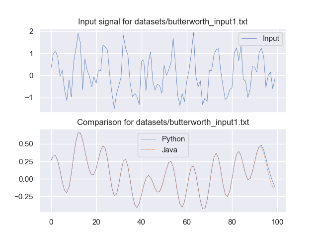

### Chebyshev Filter Comparison

**Type I:**

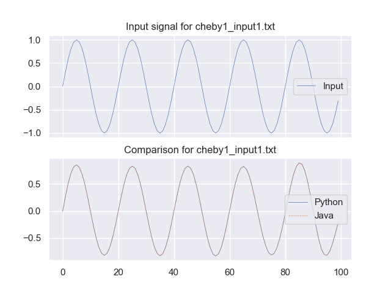

**Type II:**

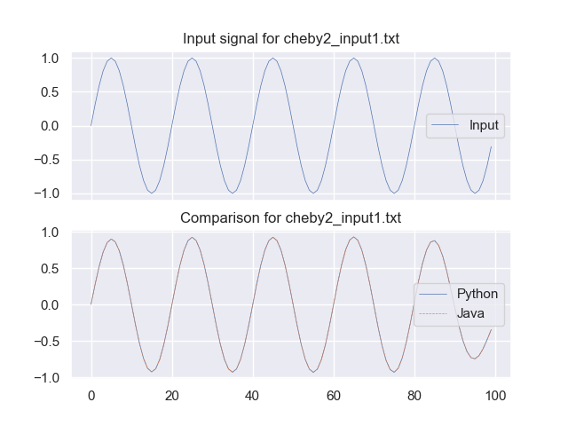

### Elliptic Filter Comparison

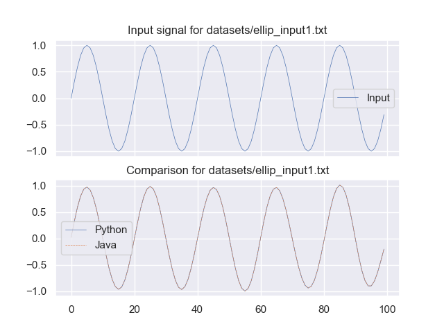

### Bessel Filter Comparison

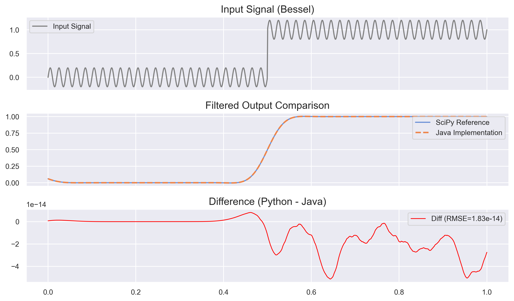

### RK4 Solver Comparison

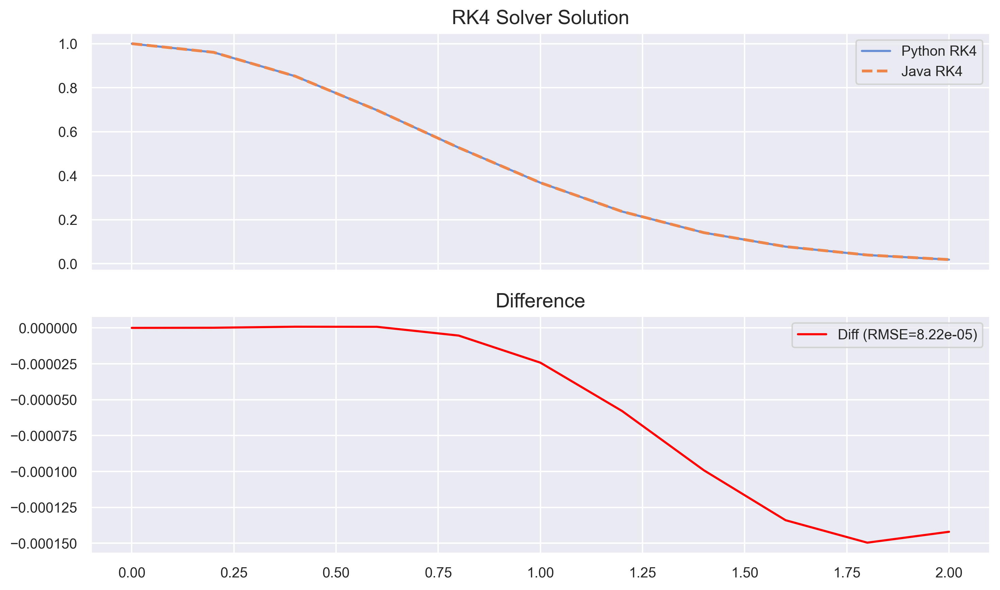

### FindPeaks Comparison

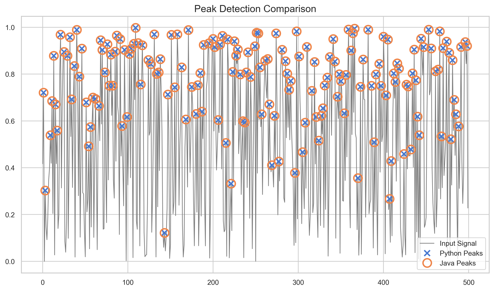

### Interpolation Comparison

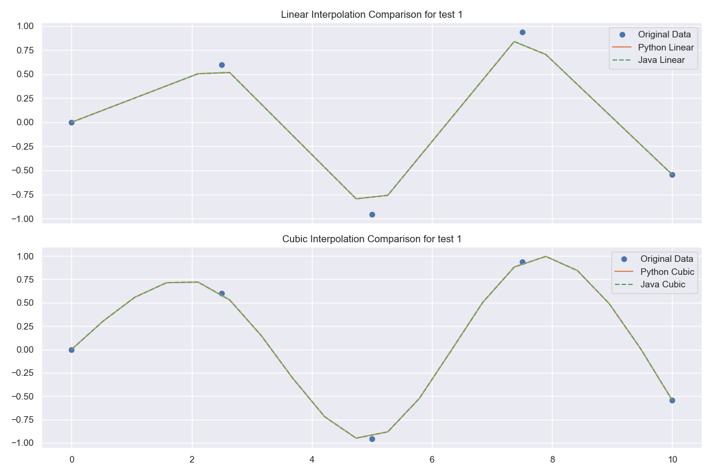

### FFT Comparison

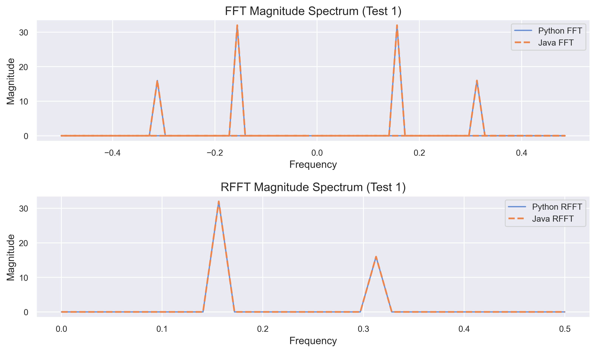

### Welch's Method Comparison

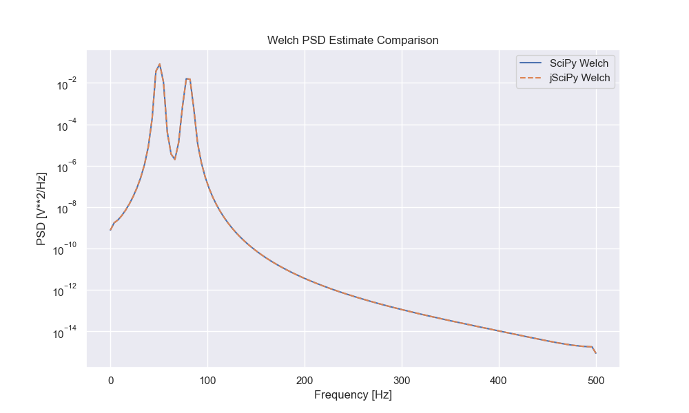

### Resample Comparison

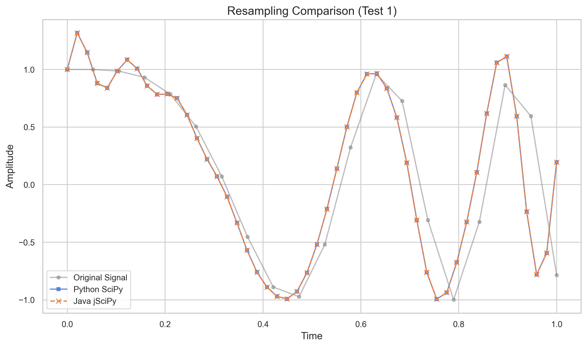

### Savitzky-Golay Comparison

**Smoothing:**

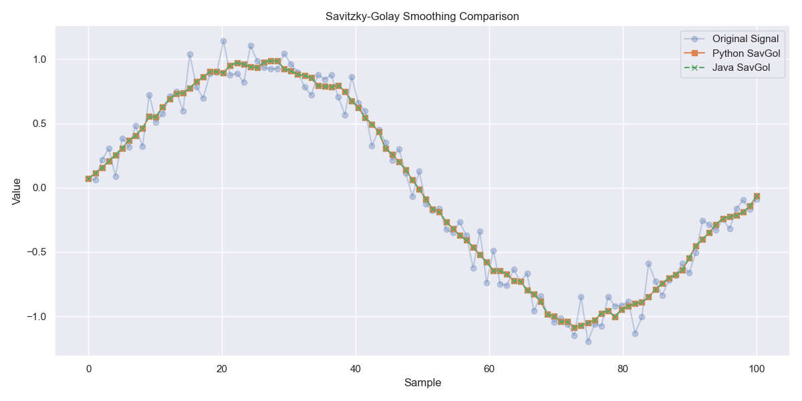

**Differentiation:**

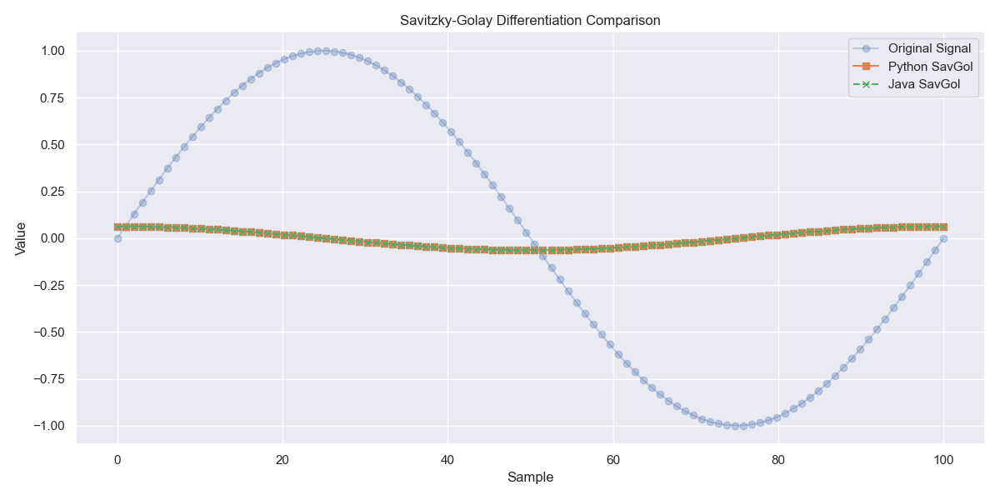

### Detrend Comparison

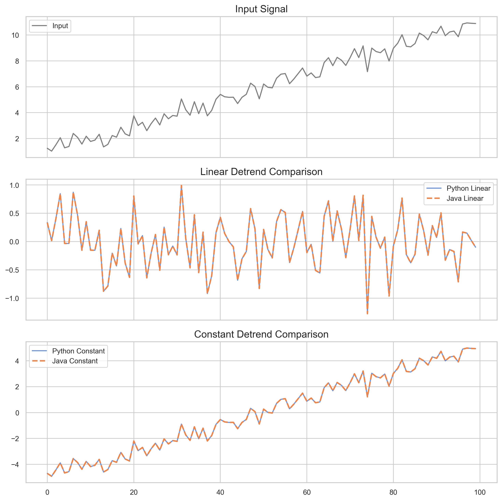

### MedFilt Comparison

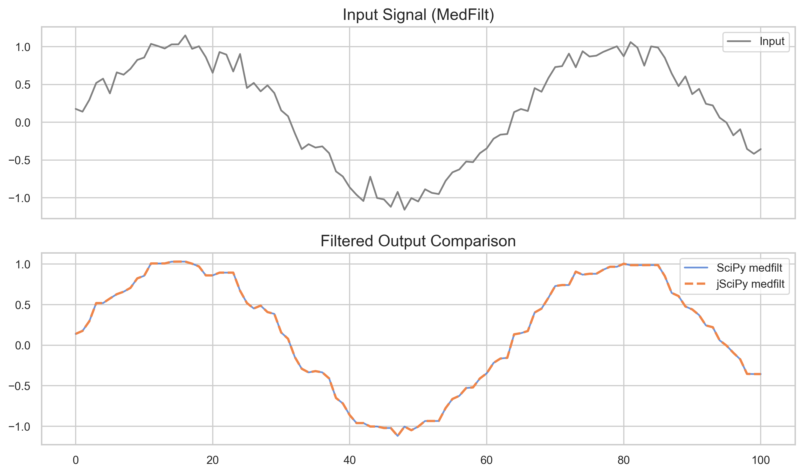

### 1D Convolve Comparison

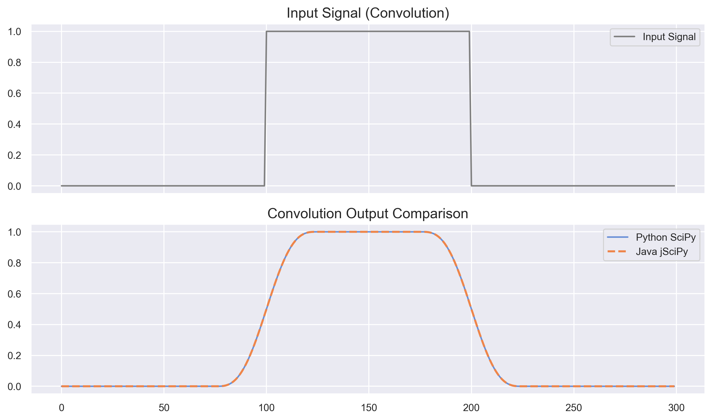

### 2D Convolve Comparison

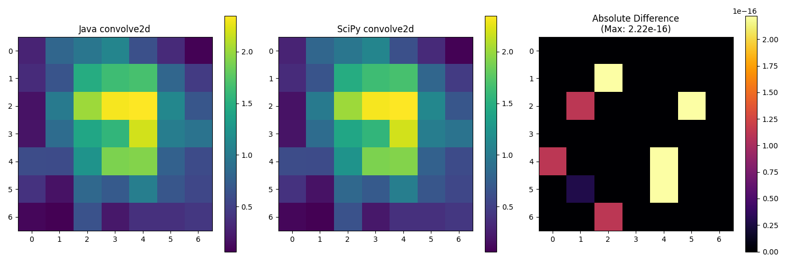

### 2D FFT Comparison

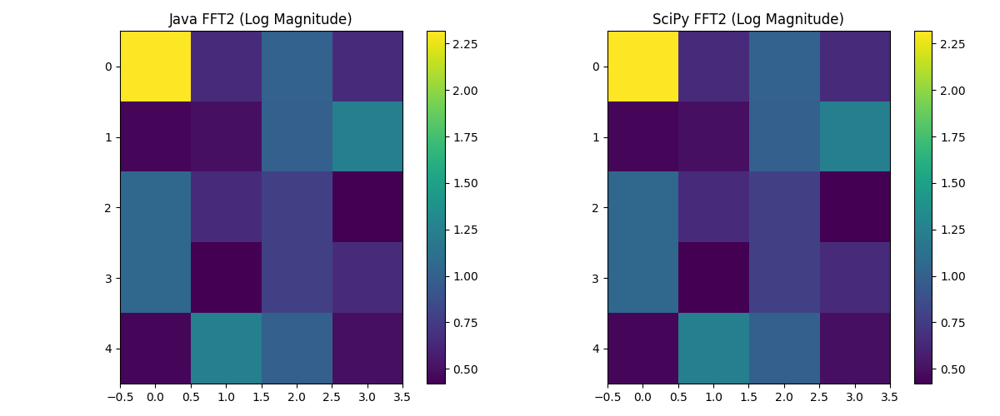

### Hilbert Transform Comparison

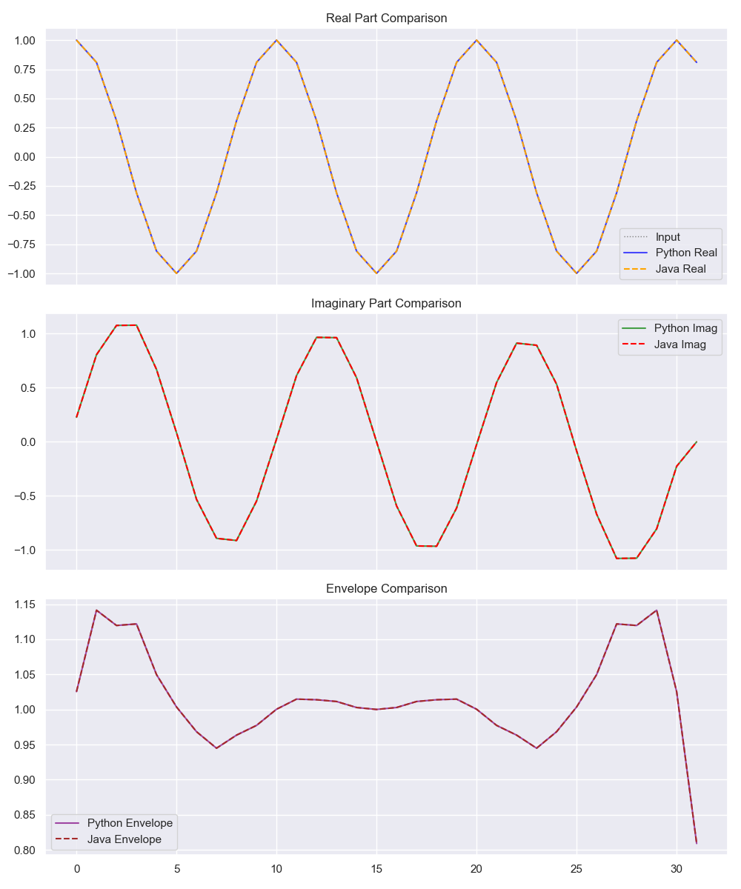

## Usage Examples

### Butterworth Filter

```java
import com.hissain.jscipy.signal.Signal;

public class FilterExample {
    public static void main(String[] args) {
        double[] signal = {1.0, 1.1, 1.2, 1.3, 1.4, 1.5, 1.4, 1.3, 1.2, 1.1, 1.0, 0.9, 0.8, 0.7, 0.6, 0.5};
        double sampleRate = 100.0; // Hz
        double cutoffFrequency = 10.0; // Hz
        int order = 4;

        // Apply a low-pass filter (zero-phase)
        double[] filteredSignal = Signal.filtfilt(signal, sampleRate, cutoffFrequency, order);

        System.out.println("Filtered Signal (filtfilt):");
        for (double value : filteredSignal) {
            System.out.printf("%.2f ", value);
        }
        System.out.println();

        // Apply a low-pass filter (causal)
        double[] causalFilteredSignal = Signal.lfilter(signal, sampleRate, cutoffFrequency, order);

        System.out.println("Filtered Signal (causal filter):");
        for (double value : causalFilteredSignal) {
            System.out.printf("%.2f ", value);
        }
        System.out.println();
    }
}
```

### Chebyshev Filters

```java
import com.hissain.jscipy.signal.Signal;

public class ChebyExample {
    public static void main(String[] args) {
        double[] signal = {1.0, 1.1, 1.2, 1.3, 1.4, 1.5, 1.4, 1.3, 1.2, 1.1, 1.0};
        double sampleRate = 100.0;
        double cutoff = 10.0;
        int order = 4;
        
        // Chebyshev Type I (passband ripple 1dB)
        double rippleDb = 1.0;
        double[] cheby1 = Signal.cheby1_filtfilt(signal, sampleRate, cutoff, order, rippleDb);
        System.out.println("Chebyshev I Filtered:");
        for(double v : cheby1) System.out.printf("%.2f ", v);
        System.out.println();
        
        // Chebyshev Type II (stopband attenuation 20dB)
        double stopBandDb = 20.0;
        double[] cheby2 = Signal.cheby2_filtfilt(signal, sampleRate, cutoff, order, stopBandDb);
        System.out.println("Chebyshev II Filtered:");
        for(double v : cheby2) System.out.printf("%.2f ", v);
        System.out.println();
    }
}
```

### Elliptic Filters

```java
import com.hissain.jscipy.signal.Signal;

public class EllipticExample {
    public static void main(String[] args) {
        double[] signal = {1.0, 1.1, 1.2, 1.3, 1.4, 1.5, 1.4, 1.3, 1.2, 1.1, 1.0};
        double sampleRate = 100.0;
        double cutoff = 10.0;
        int order = 4;
        
        // Elliptic Filter (1dB passband ripple, 40dB stopband attenuation)
        double rippleDb = 1.0;
        double stopBandDb = 40.0;

        // Zero-phase filtering
        double[] filtered = Signal.ellip_filtfilt(signal, sampleRate, cutoff, order, rippleDb, stopBandDb);
        
        System.out.println("Elliptic Filtered:");
        for(double v : filtered) System.out.printf("%.2f ", v);
        System.out.println();
    }
}
```

```

### Bessel Filter

```java
import com.hissain.jscipy.signal.Signal;

public class BesselExample {
    public static void main(String[] args) {
        double[] signal = {1.0, 1.1, 1.2, 1.3, 1.4, 1.5, 1.4, 1.3, 1.2, 1.1, 1.0};
        double sampleRate = 100.0;
        double cutoff = 10.0;
        int order = 4;
        
        // Bessel Filter (Linear Phase)
        double[] filtered = Signal.bessel_filtfilt(signal, sampleRate, cutoff, order);
        
        System.out.println("Bessel Filtered:");
        for(double v : filtered) System.out.printf("%.2f ", v);
        System.out.println();
    }
}
```

### Find Peaks

```java
import com.hissain.jscipy.signal.Signal;

public class FindPeaksExample {
    public static void main(String[] args) {
        double[] signal = {0.0, 1.0, 0.5, 2.0, 0.3, 1.5, 0.8, 3.0, 0.2, 1.0};

        // Find peaks with parameters (height=0.5, distance=2, prominence=0.5)
        int[] peaks = Signal.find_peaks(signal, 0.5, 2, 0.5);

        System.out.println("Detected Peaks at indices:");
        for (int peakIndex : peaks) {
            System.out.print(peakIndex + " ");
        }
        System.out.println();
    }
}
```

### RK4 Solver

```java
import com.hissain.jscipy.signal.RK4Solver;
import com.hissain.jscipy.signal.api.IRK4Solver;

public class RK4SolverExample {
    public static void main(String[] args) {
        // Define a simple differential equation: dy/dt = -y
        IRK4Solver.DifferentialEquation equation = (t, y) -> -y;

        double y0 = 1.0; // Initial value of y
        double t0 = 0.0; // Initial time
        double tf = 5.0; // Final time
        double h = 0.1;  // Step size

        RK4Solver solver = new RK4Solver();
        RK4Solver.Solution solution = solver.solve(equation, y0, t0, tf, h);

        System.out.println("RK4 Solver Solution:");
        System.out.println("Time (t)\tValue (y)");
        for (int i = 0; i < solution.t.length; i++) {
            System.out.printf("%.2f\t\t%.4f\n", solution.t[i], solution.y[i]);
        }
    }
}
```

### Interpolation

```java
import com.hissain.jscipy.signal.interpolate.Interpolation;

public class InterpolationExample {
    public static void main(String[] args) {
        double[] x = {0.0, 1.0, 2.0, 3.0, 4.0, 5.0};
        double[] y = {0.0, 0.8, 0.9, 0.1, -0.8, -1.0};
        double[] newX = {0.5, 1.5, 2.5, 3.5, 4.5};

        Interpolation interpolation = new Interpolation();

        // Perform linear interpolation
        double[] linearY = interpolation.linear(x, y, newX);
        System.out.println("Linear Interpolation:");
        for (int i = 0; i < newX.length; i++) {
            System.out.printf("x = %.1f, y = %.4f\n", newX[i], linearY[i]);
        }
        System.out.println();

        // Perform cubic interpolation
        double[] cubicY = interpolation.cubic(x, y, newX);
        System.out.println("Cubic Interpolation:");
        for (int i = 0; i < newX.length; i++) {
            System.out.printf("x = %.1f, y = %.4f\n", newX[i], cubicY[i]);
        }
    }
}
```

### FFT and RFFT

```java
import com.hissain.jscipy.signal.Signal;
import com.hissain.jscipy.signal.JComplex;

public class FFTExample {
    public static void main(String[] args) {
        double[] signal = {0.0, 1.0, 0.0, -1.0, 0.0, 1.0, 0.0, -1.0};

        // Compute the FFT
        JComplex[] fftResult = Signal.fft(signal);
        System.out.println("FFT Result:");
        for (JComplex c : fftResult) {
            System.out.printf("(%.2f, %.2f) ", c.getReal(), c.getImaginary());
        }
        System.out.println();

        // Compute the RFFT
        JComplex[] rfftResult = Signal.rfft(signal);
        System.out.println("RFFT Result:");
        for (JComplex c : rfftResult) {
            System.out.printf("(%.2f, %.2f) ", c.getReal(), c.getImaginary());
        }
        System.out.println();

        // Compute the IFFT
        JComplex[] ifftResult = Signal.ifft(fftResult);
        System.out.println("IFFT Result:");
        for (JComplex c : ifftResult) {
            System.out.printf("(%.2f, %.2f) ", c.getReal(), c.getImaginary());
        }
        System.out.println();

        // Compute the IRFFT
        double[] irfftResult = Signal.irfft(rfftResult, signal.length);
        System.out.println("IRFFT Result:");
        for (double d : irfftResult) {
            System.out.printf("%.2f ", d);
        }
        System.out.println();
    }
}
```

### Welch's Method (PSD)

```java
import com.hissain.jscipy.signal.fft.Welch;
import com.hissain.jscipy.signal.WelchResult;

public class WelchExample {
    public static void main(String[] args) {
        double fs = 1000.0;
        int n = 2000;
        double[] t = new double[n];
        double[] signal = new double[n];
        
        for(int i=0; i<n; i++) {
            t[i] = i / fs;
            signal[i] = Math.sin(2 * Math.PI * 50 * t[i]) + 0.5 * Math.sin(2 * Math.PI * 80 * t[i]);
        }
        
        // Compute PSD with segment length 256
        Welch welch = new Welch();
        WelchResult result = welch.welch(signal, fs, 256);
        
        System.out.println("Frequencies (first 5):");
        for(int i=0; i<5; i++) System.out.printf("%.2f ", result.f[i]);
        System.out.println("\nPSD (first 5):");
        for(int i=0; i<5; i++) System.out.printf("%.2e ", result.Pxx[i]);
        System.out.println();
    }
}
```

### Resample

```java
import com.hissain.jscipy.signal.Signal;

public class ResampleExample {
    public static void main(String[] args) {
        double[] signal = {0.0, 1.0, 0.0, -1.0, 0.0, 1.0, 0.0, -1.0};
        int num = 4;

        double[] resampledSignal = Signal.resample(signal, num);

        System.out.println("Resampled Signal:");
        for (double d : resampledSignal) {
            System.out.printf("%.2f ", d);
        }
        System.out.println();
    }
}
```

### Savitzky-Golay Filter

```java
import com.hissain.jscipy.signal.filter.SavitzkyGolayFilter;

public class SavGolExample {
    public static void main(String[] args) {
        double[] signal = {0.0, 1.0, 2.0, 1.0, 0.0, -1.0, -2.0, -1.0, 0.0};
        int windowLength = 5;
        int polyOrder = 2;

        SavitzkyGolayFilter filter = new SavitzkyGolayFilter();

        // Smooth the signal
        double[] smoothed = filter.savgol_filter(signal, windowLength, polyOrder);
        System.out.println("Smoothed Signal:");
        for (double d : smoothed) {
            System.out.printf("%.2f ", d);
        }
        System.out.println();

        // Calculate derivative (deriv=1)
        double[] derivative = filter.savgol_filter(signal, windowLength, polyOrder, 1, 1.0);
        System.out.println("First Derivative:");
        for (double d : derivative) {
            System.out.printf("%.2f ", d);
        }
        System.out.println();
    }
}
```

### Detrend

```java
import com.hissain.jscipy.signal.Signal;
import com.hissain.jscipy.signal.DetrendType;

public class DetrendExample {
    public static void main(String[] args) {
        double[] signal = {1.0, 2.0, 3.0, 4.0, 5.0}; // Linear trend
      
        // Remove linear trend
        double[] detrended = Signal.detrend(signal, DetrendType.LINEAR);
      
        System.out.println("Detrended Signal:");
        for (double d : detrended) {
            System.out.printf("%.2f ", d);
        }
        System.out.println();
    }
}
```

### MedFilt and Convolve

```java
import com.hissain.jscipy.signal.filter.MedFilt;
import com.hissain.jscipy.signal.Signal;
import com.hissain.jscipy.signal.ConvolutionMode;

public class FilterExample {
    public static void main(String[] args) {
        double[] signal = {1.0, 2.0, 3.0, 4.0, 5.0};
      
        // Median Filter
        int kernelSize = 3;
        MedFilt medFilt = new MedFilt();
        double[] medFiltered = medFilt.medfilt(signal, kernelSize);
      
        System.out.println("Median Filtered:");
        for(double v : medFiltered) System.out.print(v + " ");
        System.out.println();
      
        // Convolution
        double[] window = {0.25, 0.5, 0.25};
        double[] convolved = Signal.convolve(signal, window, ConvolutionMode.SAME);
      
        System.out.println("Convolved:");
        for(double v : convolved) System.out.print(v + " ");
        System.out.println();
    }
}
```

### Hilbert Transform

```java
import com.hissain.jscipy.signal.fft.Hilbert;
import com.hissain.jscipy.signal.JComplex;

public class HilbertExample {
    public static void main(String[] args) {
        double[] signal = {1.0, 0.0, -1.0, 0.0};
      
        Hilbert hilbert = new Hilbert();
        JComplex[] analyticSignal = hilbert.hilbert(signal);
      
        System.out.println("Analytic Signal (Real + j*Imag):");
        for (JComplex c : analyticSignal) {
            System.out.printf("%.2f + j%.2f\n", c.getReal(), c.getImaginary());
        }
    }
}
```

### Window Functions

```java
import com.hissain.jscipy.signal.Signal;

public class WindowExample {
    public static void main(String[] args) {
        int m = 10;

        // Hanning Window
        double[] hanningWindow = Signal.hanning(m);
        System.out.println("Hanning Window:");
        for (double d : hanningWindow) {
            System.out.printf("%.4f ", d);
        }
        System.out.println();

        // Hamming Window
        double[] hammingWindow = Signal.hamming(m);
        System.out.println("Hamming Window:");
        for (double d : hammingWindow) {
            System.out.printf("%.4f ", d);
        }
        System.out.println();

        // Blackman Window
        double[] blackmanWindow = Signal.blackman(m);
        System.out.println("Blackman Window:");
        for (double d : blackmanWindow) {
            System.out.printf("%.4f ", d);
        }
        System.out.println();

        // Kaiser Window (beta=14)
        double[] kaiserWindow = Signal.kaiser(m, 14.0);
        System.out.println("Kaiser Window:");
        for (double d : kaiserWindow) {
            System.out.printf("%.4f ", d);
        }
        System.out.println();
    }
}
```

## Contributing

Contributions are welcome! Please feel free to submit issues or pull requests.

## License

This project is licensed under the MIT License.
