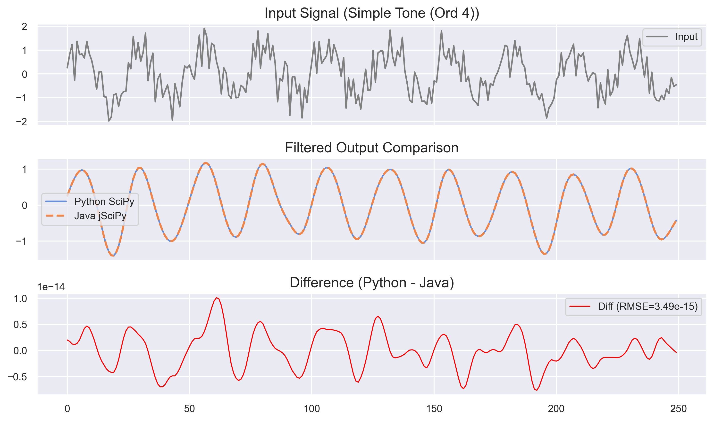
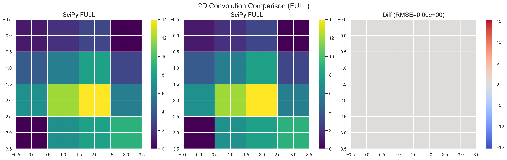
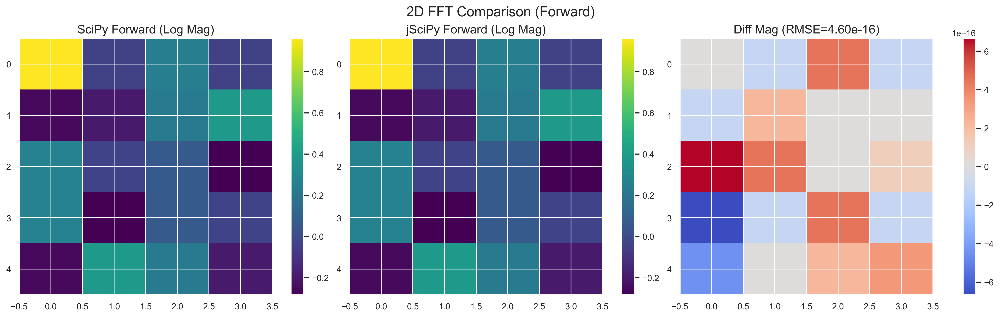

# jSciPy: Java Scientific Computing Library


[](https://jitpack.io/#hissain/jscipy)


**jSciPy** is a comprehensive **Java Scientific Computing Library** designed for **Signal Processing**, **Machine Learning**, and **Data Science** on the JVM and Android. Inspired by Python's **SciPy** and **NumPy**, it provides high-performance implementations of essential algorithms.

It currently includes modules for:
*   **Signal Processing**: Butterworth, Chebyshev, Elliptic, Bessel filters, 2D Convolution, Savitzky-Golay smoothing, Peak detection.
*   **Transformations**: FFT (Fast Fourier Transform), Hilbert Transform, Welch PSD, Spectrogram, Convolution.
*   **Math & Analysis**: RK4 ODE Solver, Interpolation (Linear, Cubic Spline), Resampling.

In modern machine learning workflows, most signal processing tasks rely on Python's SciPy utilities. However, there is no Java library that replicates SciPy's behavior with comparable completeness and consistency. This creates a significant gap for teams building ML or signal processing pipelines on the JVM. jSciPy aims to fill this gap, and the demand for such a library is higher than ever.

## Why jSciPy?

| Feature / Characteristic | **jSciPy** | **Commons Math** | **JDSP** | **TarsosDSP** |
| :--- | :---: | :---: | :---: | :---: |
| **Primary Focus** | **SciPy Clone** (Signal/Math) | General Math/Stats | Signal Processing | Audio Processing |
| **Zero-Phase Filtering (`filtfilt`)** | ✅ **Yes** | ❌ No | ❌ No | ❌ No |
| **2D Signal Ops (`conv2d`, `fft2`)** | ✅ **Yes** | ❌ No | ❌ No | ❌ No |
| **SciPy-like API** | ✅ **High** | ❌ Low | ⚠️ Partial | ❌ No |
| **Filtering Capabilities** | ⭐⭐⭐⭐⭐ | ⭐ | ⭐⭐⭐ | ⭐⭐ |

## Features

*   **Advanced Filtering**: Butterworth, Chebyshev (I & II), Elliptic, Bessel. Supports **zero-phase (`filtfilt`)** and causal (`lfilter`) modes.
*   **2D Processing**: `convolve2d` (Full/Same/Valid), `fft2`, `ifft2`.
*   **Transforms**: standard 1D `fft` / `ifft`, real-optimized `rfft` / `irfft`, `hilbert` transform.
*   **Smoothing & Analysis**: Savitzky-Golay, `find_peaks`, Welch's PSD, `spectrogram`, `detrend`, `resample`.
*   **Math**: RK4 ODE Solver, Linear & Cubic Spline Interpolation.
*   **Window Functions**: Hanning, Hamming, Blackman, Kaiser.

## Accuracy & Precision

jSciPy is rigorously tested against Python's SciPy using a "Golden Master" approach. Below is a summary of the precision (RMSE) achieved across various modules:

| Module | Test Case | RMSE (Approx) | Status |
| :--- | :--- | :--- | :--- |
| **Filters** | Butterworth, Chebyshev, Elliptic, Bessel | `1e-14` to `1e-16` | ✅ Excellent |
| **FFT** | 1D FFT, RFFT, IFFT | `1e-15` to `1e-16` | ✅ Excellent |
| **Spectral** | Spectrogram, Welch | `1e-17` to `1e-18` | ✅ Excellent |
| **2D Ops** | 2D FFT, 2D Convolution | `1e-16` | ✅ Excellent |
| **Math** | Interpolation, Resample | `1e-16` | ✅ Excellent |
| **ODE** | RK4 Solver | `8e-5` | ✅ Good (Method dependent) |

## Documentation

You can access full documentation javadoc of the jscipy library [HERE](https://hissain.github.io/jscipy).

## Getting Started

### Prerequisites

* Java Development Kit (JDK) 8 or higher
* Gradle (for building the project)

## How to Include as a Dependency (JitPack)

JitPack is a novel package repository for JVM projects. It builds GitHub projects on demand and provides ready-to-use artifacts (jar, javadoc, sources).

To use this library in your Gradle project, add the JitPack repository and the dependency to your `build.gradle` file:

```gradle
// In your root build.gradle (or settings.gradle for repository definition)
allprojects {
    repositories {
        mavenCentral()
        maven { url 'https://jitpack.io' }
    }
}

// In your app's build.gradle
dependencies {
    implementation 'com.github.hissain:jSciPy:3.0.1' // Replace 3.0.1 with the desired version or commit hash
}
```

## Exmple Demo Android Application

A seperate demo android application is built on this library that might be helpful to understand how to consume this library. The application can be accessed [here](https://github.com/hissain/jscipy-android).

## Comparison Graphs

### Butterworth Filter Comparison



### Chebyshev Filter Comparison

**Type I:**


**Type II:**


### Elliptic Filter Comparison


### Bessel Filter Comparison


### RK4 Solver Comparison


### FindPeaks Comparison


### Interpolation Comparison


### FFT Comparison


### Welch's Method Comparison


### Spectrogram Comparison


### Resample Comparison


### Savitzky-Golay Comparison

**Smoothing:**


**Differentiation:**


### Detrend Comparison


### MedFilt Comparison


### 1D Convolve Comparison


### 2D Convolve Comparison



### 2D FFT Comparison



### Hilbert Transform Comparison


## Usage Examples

### Digital Filters
All standard IIR filters (Butterworth, Chebyshev I/II, Elliptic, Bessel) are supported with consistent APIs.

```java
import com.hissain.jscipy.Signal;

public class FilterExample {
    public static void main(String[] args) {
        double[] signal = {/*... input data ...*/};
        double fs = 100.0;
        double fc = 10.0;
        int order = 4;

        // 1. Butterworth: Zero-phase vs Causal
        double[] zeroPhase = Signal.filtfilt(signal, fs, fc, order);
        double[] causal = Signal.lfilter(signal, fs, fc, order);

        // 2. Chebyshev Type I (Ripple 1dB) & Type II (Stopband 20dB)
        double[] cheby1 = Signal.cheby1_filtfilt(signal, fs, fc, order, 1.0);
        double[] cheby2 = Signal.cheby2_filtfilt(signal, fs, fc, order, 20.0);

        // 3. Elliptic (Ripple 1dB, Stopband 40dB)
        double[] ellip = Signal.ellip_filtfilt(signal, fs, fc, order, 1.0, 40.0);
        
        // 4. Bessel (Linear Phase)
        double[] bessel = Signal.bessel_filtfilt(signal, fs, fc, order);

        // Filter Modes: High-pass, Band-pass, Band-stop
        // Available for all filter types (suffix: _highpass, _bandpass, _bandstop)
        double[] bandPass = Signal.filtfilt_bandpass(signal, fs, 8.0, 4.0, order); // Center=10, Width=4
    }
}
```

### Spectral Analysis & Transforms
Includes 1D/2D FFT, Hilbert Transform, Welch's Method, and Spectrograms.

```java
import com.hissain.jscipy.Signal;
import com.hissain.jscipy.signal.JComplex;
import com.hissain.jscipy.signal.fft.Welch;
import com.hissain.jscipy.signal.fft.Spectrogram;
import com.hissain.jscipy.signal.fft.Hilbert;

public class SpectralExample {
    public static void main(String[] args) {
        double[] signal = {/*... input data ...*/};
        double fs = 1000.0;

        // 1. FFT / IFFT
        JComplex[] fft = Signal.fft(signal);
        JComplex[] ifft = Signal.ifft(fft);
        
        // 2. Real-optimized FFT (RFFT)
        JComplex[] rfft = Signal.rfft(signal);
        
        // 3. Welch's Method (PSD)
        Welch.WelchResult psd = Signal.welch(signal, fs, 256);
        // Access: psd.f (frequencies), psd.Pxx (power spectrum)

        // 4. Spectrogram
        Spectrogram.SpectrogramResult spec = Signal.spectrogram(signal, fs);
        // Access: spec.frequencies, spec.times, spec.Sxx

        // 5. Hilbert Transform (Analytic Signal)
        Hilbert h = new Hilbert();
        JComplex[] analytic = h.hilbert(signal);
    }
}
```

### Smoothing & Signal Operations
Common operations for signal conditioning and feature extraction.

```java
import com.hissain.jscipy.Signal;
import com.hissain.jscipy.signal.filter.SavitzkyGolayFilter;
import com.hissain.jscipy.signal.filter.MedFilt;

public class OperationsExample {
    public static void main(String[] args) {
        double[] signal = {/*... data ...*/};

        // 1. Savitzky-Golay Smoothing
        SavitzkyGolayFilter sg = new SavitzkyGolayFilter();
        double[] smoothed = sg.savgol_filter(signal, 5, 2); // Window=5, PolyOrder=2
        double[] deriv = sg.savgol_filter(signal, 5, 2, 1, 1.0); // 1st Derivative

        // 2. Peak Detection
        // Min Height=0.5, Min Distance=10, Min Prominence=0.2
        int[] peaks = Signal.find_peaks(signal, 0.5, 10, 0.2);

        // 3. Median Filter
        double[] med = new MedFilt().medfilt(signal, 3); // Kernel=3

        // 4. Convolution (Mode: SAME, FULL, VALID)
        double[] window = {0.25, 0.5, 0.25};
        double[] conv = Signal.convolve(signal, window, ConvolutionMode.SAME);
        
        // 5. Detrending (Linear)
        double[] detrended = Signal.detrend(signal, DetrendType.LINEAR);
        
        // 6. Resampling (Up/Down sampling)
        // Note: Resampling is part of the Math module
        double[] resampled = com.hissain.jscipy.Math.resample(signal, NEW_LENGTH);
    }
}
```

### Math & Interpolation
General-purpose numerical utilities.

```java
import com.hissain.jscipy.math.RK4Solver;
import com.hissain.jscipy.Math;

public class MathExample {
    public static void main(String[] args) {
        // 1. Interpolation (Linear & Cubic)
        double[] x = {0, 1, 2}, y = {0, 1, 4};
        double[] query = {0.5, 1.5};
        
        double[] lin = Math.interp1d_linear(x, y, query);
        double[] cub = Math.interp1d_cubic(x, y, query);

        // 2. RK4 ODE Solver (dy/dt = -y)
        RK4Solver solver = new RK4Solver();
        RK4Solver.Solution sol = solver.solve((t, y) -> -y, y0, t0, tf, step);
    }
}
```

## Contributing

Contributions are welcome! Please read our [Contribution Guidelines](CONTRIBUTING.md) for details on our workflow and coding standards. Feel free to submit issues or pull requests.

### Areas for Contribution (Help Wanted)

We are actively looking for contributors to help with:
1.  **Performance Benchmarking**: Creating benchmarks for large datasets to compare Java's performance vs NumPy/SciPy.
2.  **Feature Expansion**: Implementing missing window functions or additional filter types.
3.  **Edge Case Robustness**: Improving handling of `NaN`, `Infinity`, and edge cases in signal processing algorithms.
4.  **Documentation**: Adding more usage examples and javadocs.

## License

This project is licensed under the [MIT License](LICENSE).
