<div align="center">
  <picture>
    <source media="(prefers-color-scheme: dark)" srcset="docs/logo_landscape_dark.jpg">
    <source media="(prefers-color-scheme: light)" srcset="docs/logo_landscape.jpg">
    
  </picture>
  <h1>jSciPy: Java Scientific Computing Library</h1>

  
  [](https://jitpack.io/#hissain/jscipy)
  [](https://jitpack.io/com/github/hissain/jscipy/latest/javadoc/)
  [](https://hissain.github.io/jscipy)
  [](https://discord.gg/ZfAEWc84J)
  
</div>

**jSciPy** is a comprehensive **Java Scientific Computing and Signal Processing Library** designed for **Machine Learning** on the JVM and Android. Inspired by Python's **SciPy**, it provides high-performance implementations of essential algorithms.

It currently includes modules for:
*   **Signal Processing**: Butterworth, Chebyshev, Elliptic, Bessel, and FIR (`firwin`) filters, Window Functions, 2D Convolution, Savitzky-Golay smoothing, Peak detection, Detrending, Median Filter.
*   **Transformations**: FFT (Fast Fourier Transform), Hilbert Transform, Welch PSD, Spectrogram, Periodogram, Convolution, DCT/IDCT.
*   **Math & Analysis**: RK4 ODE Solver, Interpolation (Linear, Cubic Spline, Quadratic, B-Spline), Resampling, Polynomial fitting.

In modern machine learning workflows, most signal processing tasks rely on Python's SciPy utilities. However, there is no Java library that replicates SciPy's behavior with comparable completeness and consistency. This creates a significant gap for teams building ML or signal processing pipelines on the JVM. jSciPy aims to fill this gap, and the demand for such a library is higher than ever.

## Table of Contents

- [Why jSciPy?](#why-jscipy)
- [Features](#features)
- [Accuracy & Precision](#accuracy--precision)
- [Documentation](#documentation)
- [Getting Started](#getting-started)
- [How to Include as a Dependency (JitPack)](#how-to-include-as-a-dependency-jitpack)
- [Demo Android Application](#demo-android-application)
- [Comparison Graphs](#comparison-graphs)
  - [Butterworth Filter](#butterworth-filter-comparison)
  - [Chebyshev Filter](#chebyshev-filter-comparison)
  - [Elliptic Filter](#elliptic-filter-comparison)
  - [Bessel Filter](#bessel-filter-comparison)
  - [RK4 Solver](#rk4-solver-comparison)
  - [FindPeaks](#findpeaks-comparison)
  - [Interpolation](#interpolation-comparison)
  - [FFT](#fft-comparison)
  - [Welch's Method](#welchs-method-comparison)
  - [Spectrogram](#spectrogram-comparison)
  - [STFT/ISTFT](#stftistft-comparison)
  - [Periodogram](#periodogram-comparison)
  - [Resample](#resample-comparison)
  - [Savitzky-Golay](#savitzky-golay-comparison)
  - [Detrend](#detrend-comparison)
  - [MedFilt](#medfilt-comparison)
  - [1D Convolve](#1d-convolve-comparison)
  - [2D Convolve](#2d-convolve-comparison)
  - [Cross-Correlation](#cross-correlation-comparison)
  - [DCT](#dct-comparison)
  - [Polynomial Fit](#polynomial-fit-comparison)
  - [2D FFT](#2d-fft-comparison)
  - [Hilbert Transform](#hilbert-transform-comparison)
  - [SOS Filtering](#sos-filtering-comparison)
  - [Window Functions](#window-functions-comparison)
- [Usage Examples](#usage-examples)
- [Contributing](#contributing)
- [License](#license)

## Why jSciPy?

The table below compares jSciPy’s signal processing and scientific computing features with several other popular Java libraries, highlighting areas where jSciPy provides more comprehensive functionality.

The table below compares jSciPy’s signal processing and scientific computing features with several other popular Java libraries, highlighting areas where jSciPy provides more comprehensive functionality.

<picture>
  <source media="(prefers-color-scheme: dark)" srcset="python/figs/comparison_summary_dark.png">
  <source media="(prefers-color-scheme: light)" srcset="python/figs/comparison_summary_light.png">
  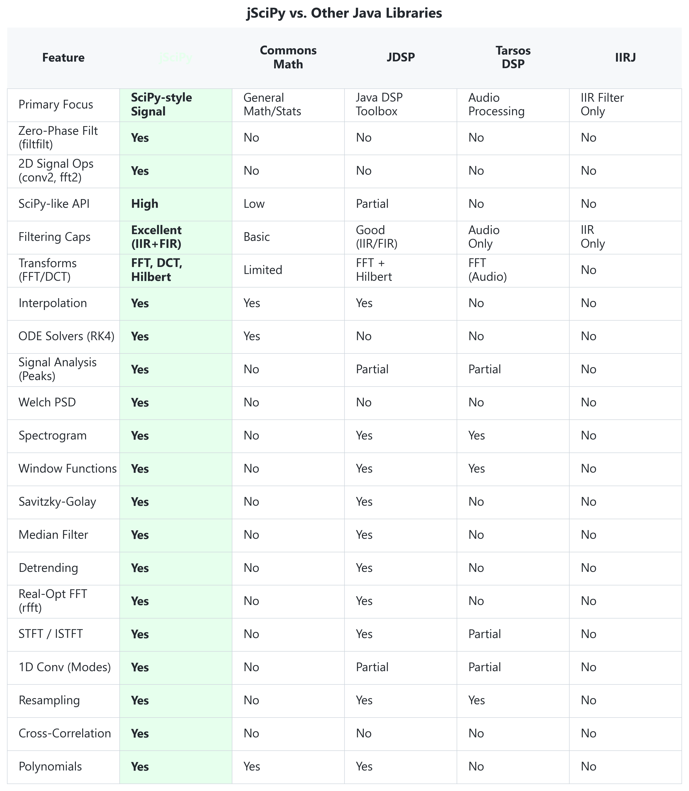
</picture>

<p align="center">
  <a href="python/figs/comparison_summary_light.png">View full size (light)</a> &nbsp;|&nbsp; <a href="python/figs/comparison_summary_dark.png">View full size (dark)</a>
</p>


## Features

*   **Advanced Filtering**: Butterworth, Chebyshev, Elliptic, Bessel, **FIR Design (`firwin`)**. Supports **zero-phase (`filtfilt`)**, causal (`lfilter`), and **Second-Order Sections (`sosfilt`)** modes.
*   **2D Processing**: `convolve2d` (Full/Same/Valid), `fft2`, `ifft2`.
*   **Transforms**: standard 1D `fft` / `ifft`, real-optimized `rfft` / `irfft`, `dct` / `idct` (Discrete Cosine Transform), `stft` / `istft`, `hilbert` transform.
*   **Smoothing & Analysis**: Savitzky-Golay, `medfilt` (Median Filter), `find_peaks`, Welch's PSD, `spectrogram`, `detrend`, `resample`.
*   **Interpolation**: linear, cubic spline, quadratic, and generalized B-spline interpolation.
*   **Correlation**: `correlate` (Cross-Correlation with FULL/SAME/VALID modes).
*   **Polynomials**: `polyfit`, `polyval`, `polyder`.
*   **Window Functions**: Hamming, Hanning, Blackman, Kaiser, Bartlett, Flat-top, Parzen, Bohman, Triangle.
*   **Numerical Methods**: Interpolation (Linear, Quadratic, Cubic Spline, B-Spline), RK4 ODE Solver.

## Accuracy & Precision

jSciPy is rigorously tested against Python's SciPy using a "Golden Master" approach. Below is a summary of the precision (RMSE) achieved across various modules:

<picture>
  <source media="(prefers-color-scheme: dark)" srcset="python/figs/accuracy_summary_dark.png">
  <source media="(prefers-color-scheme: light)" srcset="python/figs/accuracy_summary_light.png">
  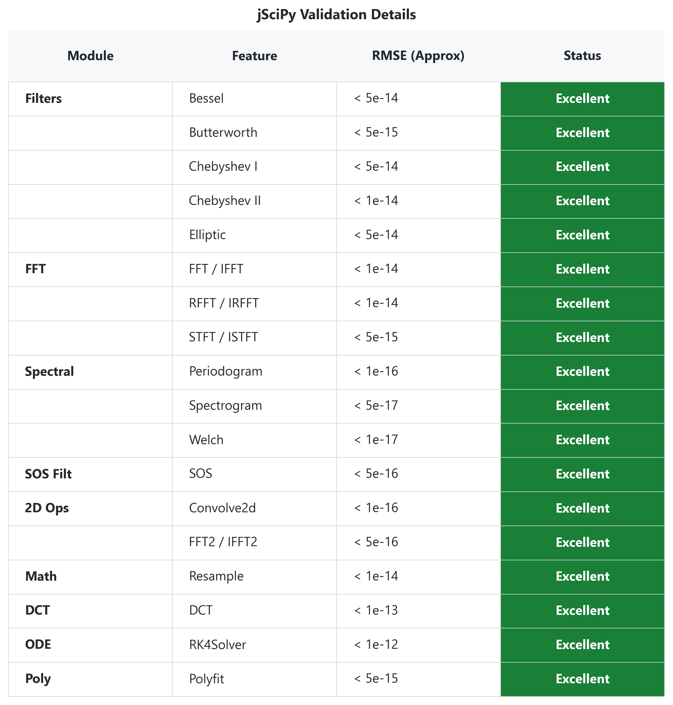
</picture>

<p align="center">
  <a href="python/figs/accuracy_summary_light.png">View full size (light)</a> &nbsp;|&nbsp; <a href="python/figs/accuracy_summary_dark.png">View full size (dark)</a>
</p>

## Documentation

You can access full documentation javadoc of the jscipy library [HERE](https://hissain.github.io/jscipy).

## Getting Started

### Prerequisites

* Java Development Kit (JDK) 8 or higher
* Gradle (for building the project)

## How to Include as a Dependency (JitPack)

JitPack is a novel package repository for JVM projects. It builds GitHub projects on demand and provides ready-to-use artifacts (jar, javadoc, sources).

To use this library in your Gradle project, add the JitPack repository and the dependency to your `build.gradle` file:

```gradle
// In your root build.gradle (or settings.gradle for repository definition)
allprojects {
    repositories {
        mavenCentral()
        maven { url 'https://jitpack.io' }
    }
}

// In your app's build.gradle
dependencies {
    implementation 'com.github.hissain:jSciPy:3.1.4' // Replace 3.1.4 with the desired version or commit hash
}
```

## Demo Android Application

A seperate demo android application is built on this library that might be helpful to understand how to consume this library. The application can be accessed [here](https://github.com/hissain/jscipy-android).

## Comparison Graphs

### Butterworth Filter Comparison

<picture>
  <source media="(prefers-color-scheme: dark)" srcset="python/figs/butterworth/butterworth_simple_o4_input.txt_dark.png">
  <source media="(prefers-color-scheme: light)" srcset="python/figs/butterworth/butterworth_simple_o4_input.txt_light.png">
  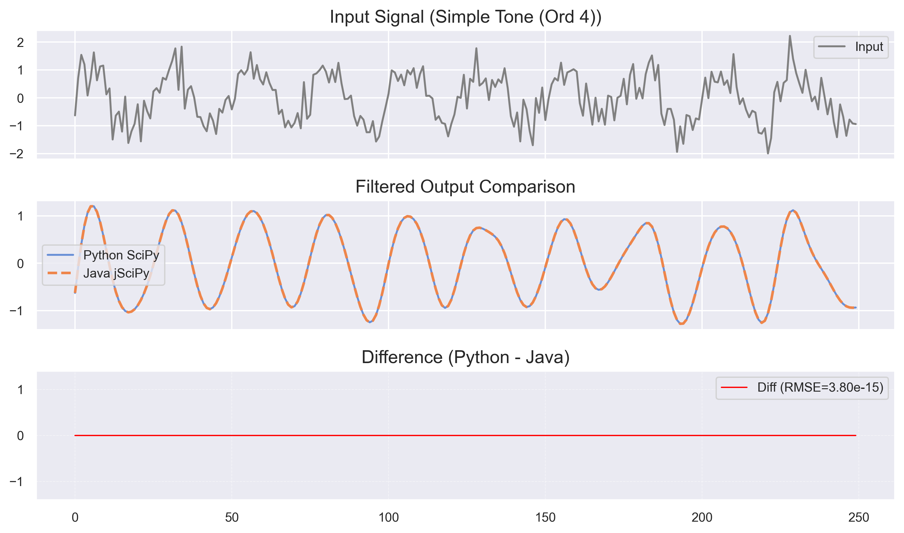
</picture>

### Chebyshev Filter Comparison

**Type I:**

<picture>
  <source media="(prefers-color-scheme: dark)" srcset="python/figs/chebyshev/cheby1_input1.txt_dark.png">
  <source media="(prefers-color-scheme: light)" srcset="python/figs/chebyshev/cheby1_input1.txt_light.png">
  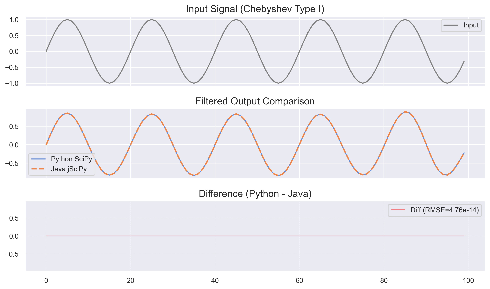
</picture>

**Type II:**

<picture>
  <source media="(prefers-color-scheme: dark)" srcset="python/figs/chebyshev/cheby2_input1.txt_dark.png">
  <source media="(prefers-color-scheme: light)" srcset="python/figs/chebyshev/cheby2_input1.txt_light.png">
  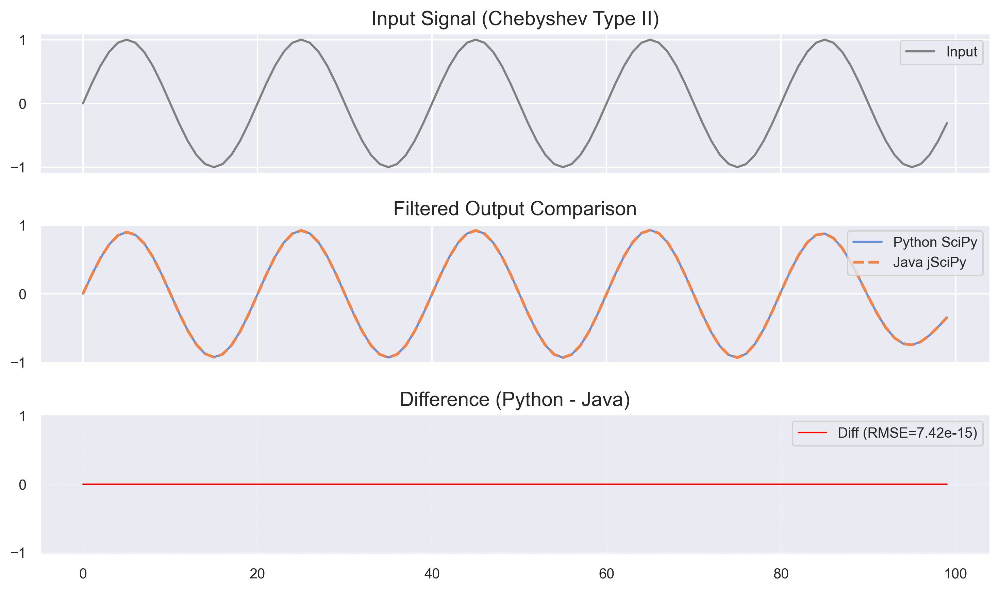
</picture>

### Elliptic Filter Comparison

<picture>
  <source media="(prefers-color-scheme: dark)" srcset="python/figs/elliptic/ellip_input1.txt_dark.png">
  <source media="(prefers-color-scheme: light)" srcset="python/figs/elliptic/ellip_input1.txt_light.png">
  
</picture>

### Bessel Filter Comparison

<picture>
  <source media="(prefers-color-scheme: dark)" srcset="python/figs/bessel/bessel_comparison_dark.png">
  <source media="(prefers-color-scheme: light)" srcset="python/figs/bessel/bessel_comparison_light.png">
  
</picture>

### RK4 Solver Comparison

<picture>
  <source media="(prefers-color-scheme: dark)" srcset="python/figs/rk4/rk4_comparison_dark.png">
  <source media="(prefers-color-scheme: light)" srcset="python/figs/rk4/rk4_comparison_light.png">
  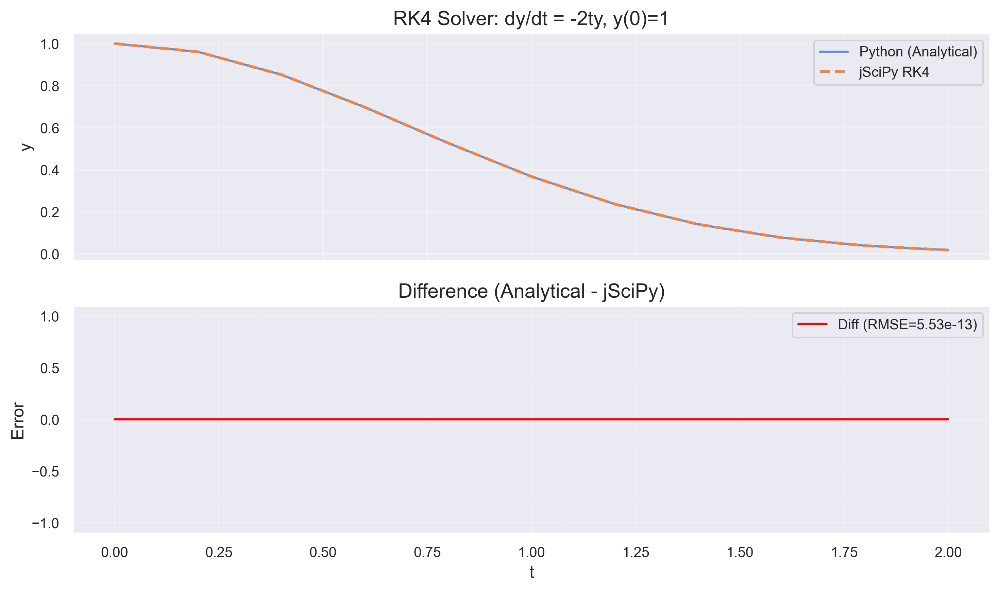
</picture>

### FindPeaks Comparison

<picture>
  <source media="(prefers-color-scheme: dark)" srcset="python/figs/findpeaks/findpeaks_input1.txt_peaks_dark.png">
  <source media="(prefers-color-scheme: light)" srcset="python/figs/findpeaks/findpeaks_input1.txt_peaks_light.png">
  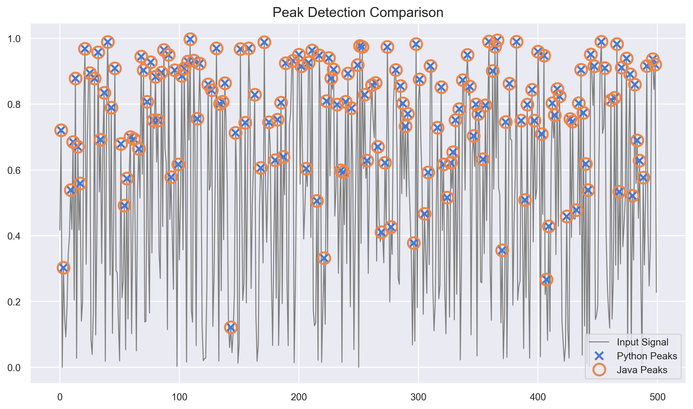
</picture>

### Interpolation Comparison

<picture>
  <source media="(prefers-color-scheme: dark)" srcset="python/figs/interpolation/interpolation_comparison_2_dark.png">
  <source media="(prefers-color-scheme: light)" srcset="python/figs/interpolation/interpolation_comparison_2_light.png">
  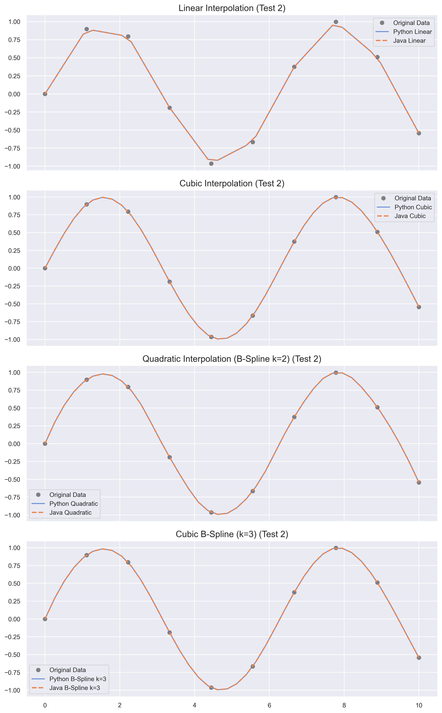
</picture>

### FFT Comparison

<picture>
  <source media="(prefers-color-scheme: dark)" srcset="python/figs/fft/fft_comparison_1_dark.png">
  <source media="(prefers-color-scheme: light)" srcset="python/figs/fft/fft_comparison_1_light.png">
  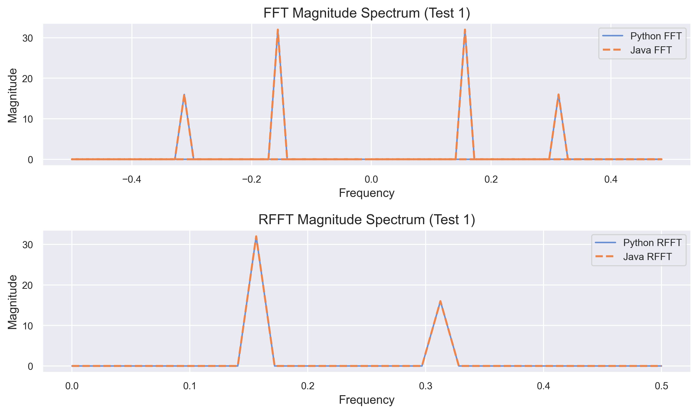
</picture>

### Welch's Method Comparison

<picture>
  <source media="(prefers-color-scheme: dark)" srcset="python/figs/welch/welch_comparison_dark.png">
  <source media="(prefers-color-scheme: light)" srcset="python/figs/welch/welch_comparison_light.png">
  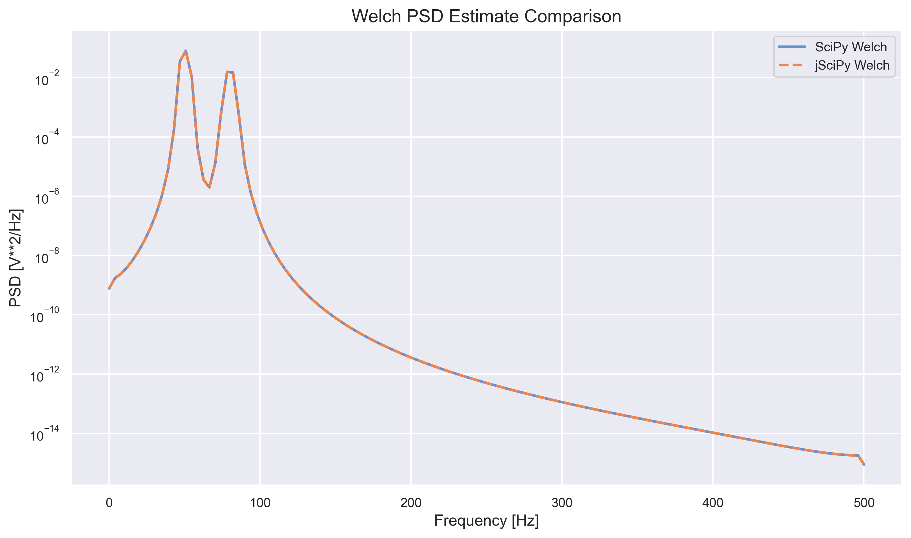
</picture>

### Spectrogram Comparison

<picture>
  <source media="(prefers-color-scheme: dark)" srcset="python/figs/spectrogram/spectrogram_chirp_comparison_dark.png">
  <source media="(prefers-color-scheme: light)" srcset="python/figs/spectrogram/spectrogram_chirp_comparison_light.png">
  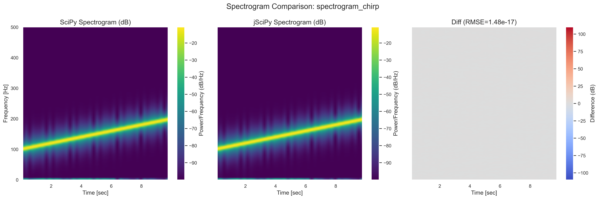
</picture>

### STFT/ISTFT Comparison

<picture>
  <source media="(prefers-color-scheme: dark)" srcset="python/figs/stft/stft_comparison_dark.png">
  <source media="(prefers-color-scheme: light)" srcset="python/figs/stft/stft_comparison_light.png">
  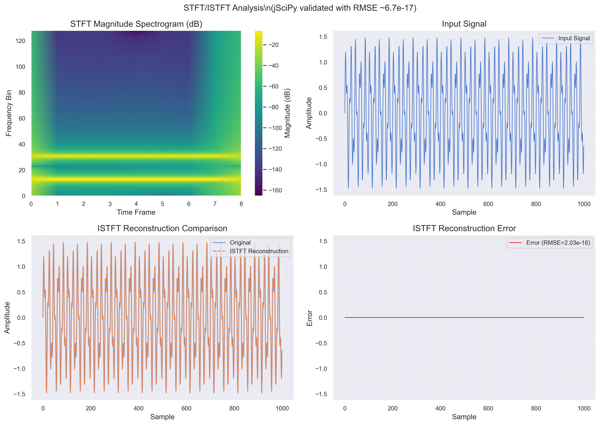
</picture>

### Periodogram Comparison

<picture>
  <source media="(prefers-color-scheme: dark)" srcset="python/figs/periodogram/periodogram_comparison_dark.png">
  <source media="(prefers-color-scheme: light)" srcset="python/figs/periodogram/periodogram_comparison_light.png">
  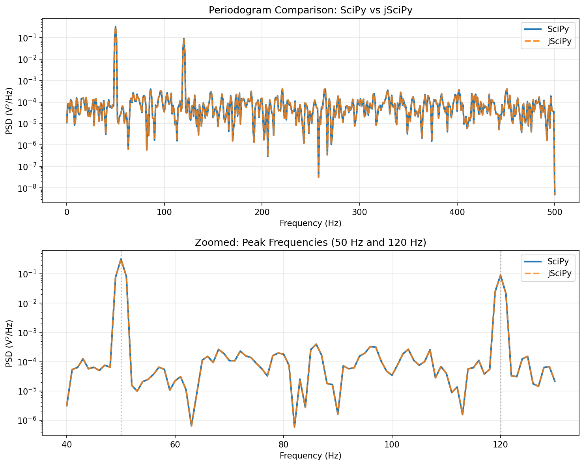
</picture>

### Resample Comparison

<picture>
  <source media="(prefers-color-scheme: dark)" srcset="python/figs/resample/resample_comparison_1_dark.png">
  <source media="(prefers-color-scheme: light)" srcset="python/figs/resample/resample_comparison_1_light.png">
  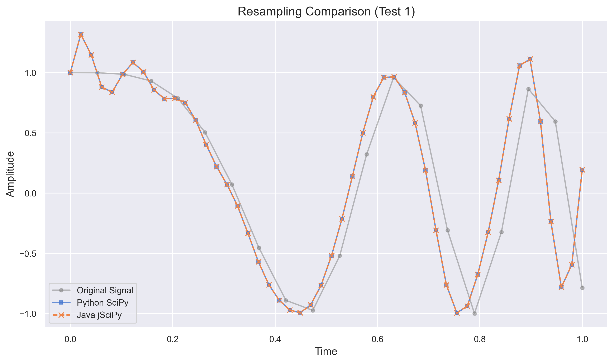
</picture>

### Savitzky-Golay Comparison

**Smoothing:**

<picture>
  <source media="(prefers-color-scheme: dark)" srcset="python/figs/savgol/savitzky_golay_smoothing_dark.png">
  <source media="(prefers-color-scheme: light)" srcset="python/figs/savgol/savitzky_golay_smoothing_light.png">
  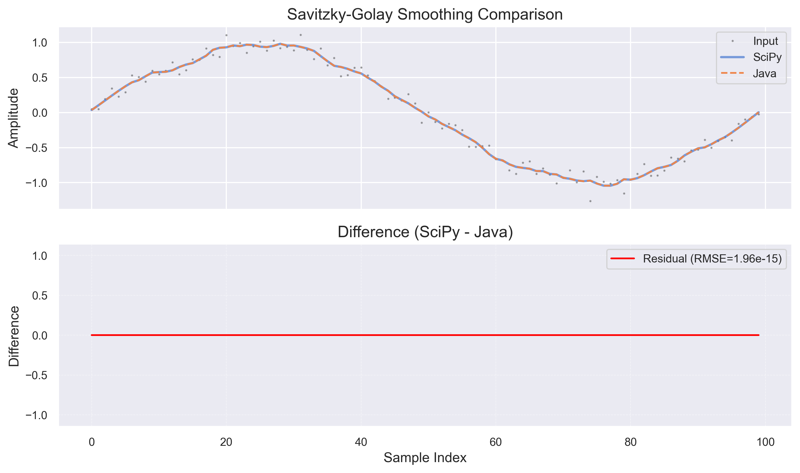
</picture>

**Differentiation:**

<picture>
  <source media="(prefers-color-scheme: dark)" srcset="python/figs/savgol/savitzky_golay_differentiation_dark.png">
  <source media="(prefers-color-scheme: light)" srcset="python/figs/savgol/savitzky_golay_differentiation_light.png">
  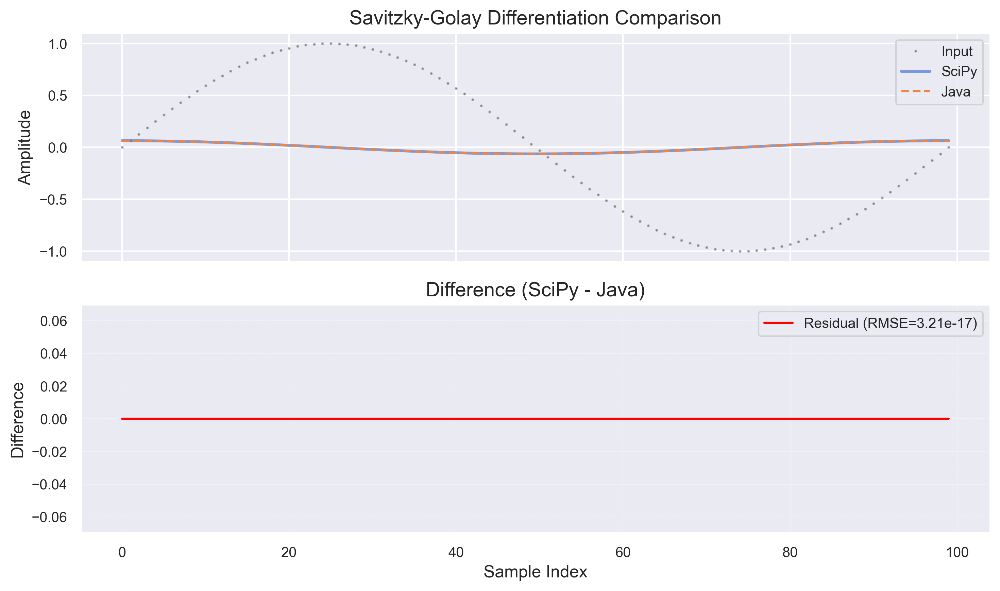
</picture>

### Detrend Comparison

<picture>
  <source media="(prefers-color-scheme: dark)" srcset="python/figs/detrend/detrend_comparison_1_dark.png">
  <source media="(prefers-color-scheme: light)" srcset="python/figs/detrend/detrend_comparison_1_light.png">
  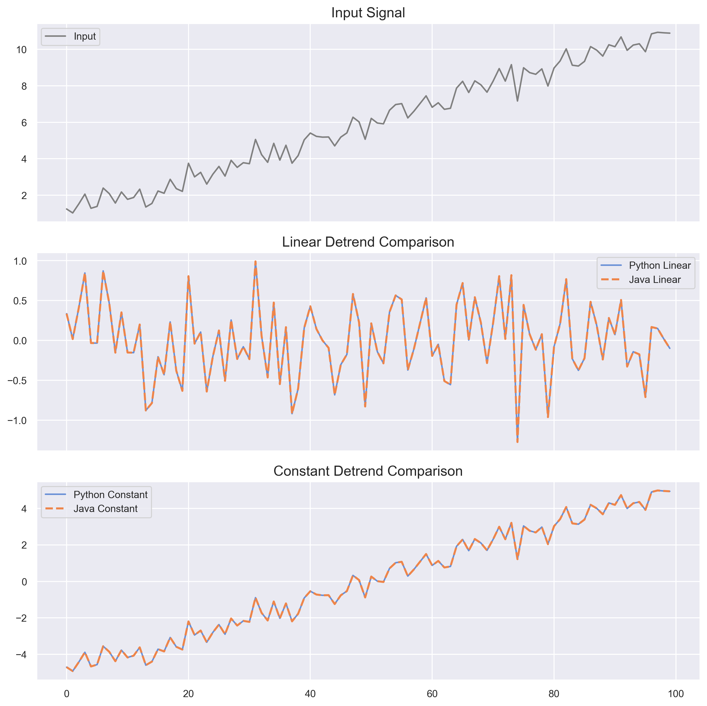
</picture>

### MedFilt Comparison

<picture>
  <source media="(prefers-color-scheme: dark)" srcset="python/figs/medfilt/medfilt_comparison_dark.png">
  <source media="(prefers-color-scheme: light)" srcset="python/figs/medfilt/medfilt_comparison_light.png">
  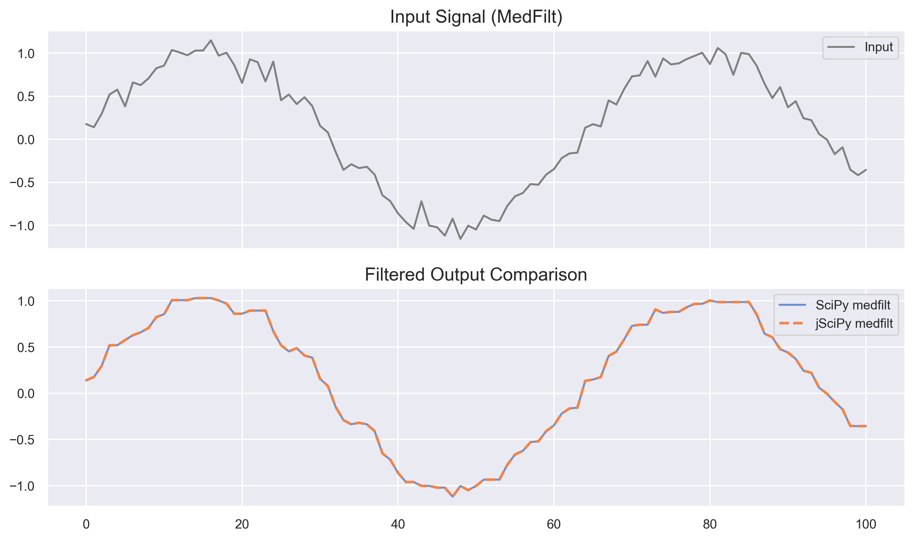
</picture>

### 1D Convolve Comparison

<picture>
  <source media="(prefers-color-scheme: dark)" srcset="python/figs/convolve/convolve_comparison_dark.png">
  <source media="(prefers-color-scheme: light)" srcset="python/figs/convolve/convolve_comparison_light.png">
  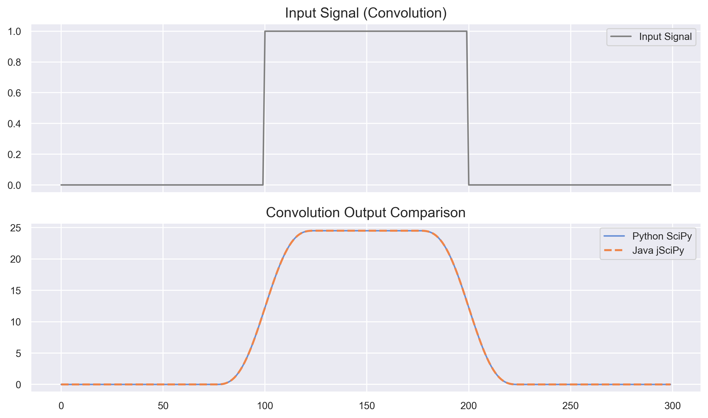
</picture>


### 2D Convolve Comparison

<picture>
  <source media="(prefers-color-scheme: dark)" srcset="python/figs/convolve2d/convolve2d_comparison_full_dark.png">
  <source media="(prefers-color-scheme: light)" srcset="python/figs/convolve2d/convolve2d_comparison_full_light.png">
  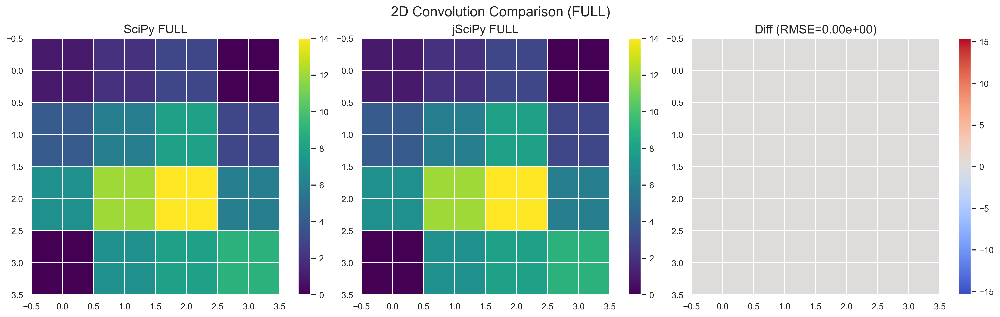
</picture>

### Cross-Correlation Comparison

<picture>
  <source media="(prefers-color-scheme: dark)" srcset="python/figs/correlate/correlate_comparison_dark.png">
  <source media="(prefers-color-scheme: light)" srcset="python/figs/correlate/correlate_comparison_light.png">
  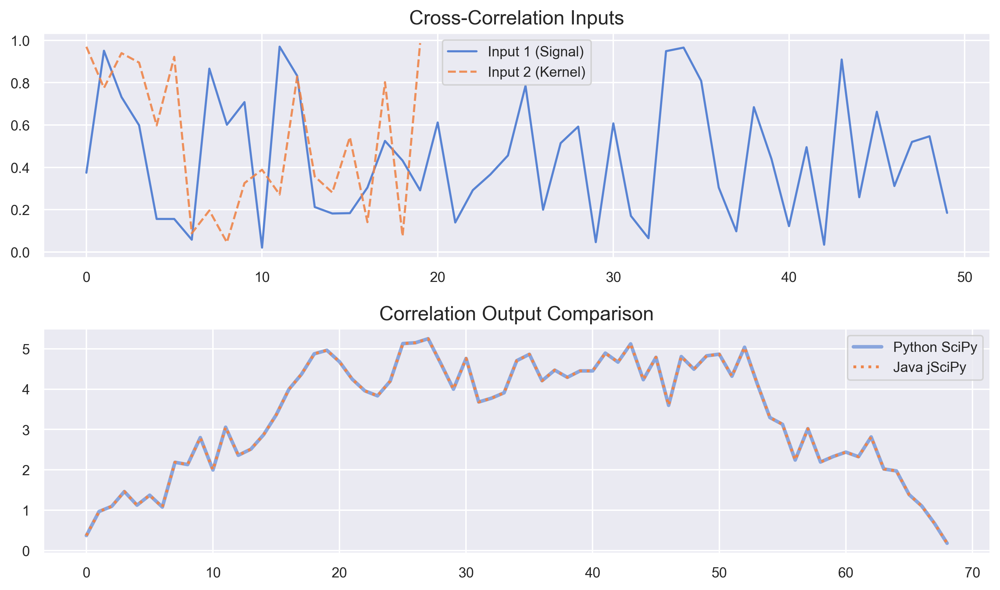
</picture>

### DCT Comparison

<picture>
  <source media="(prefers-color-scheme: dark)" srcset="python/figs/dct/dct_comparison_dark.png">
  <source media="(prefers-color-scheme: light)" srcset="python/figs/dct/dct_comparison_light.png">
  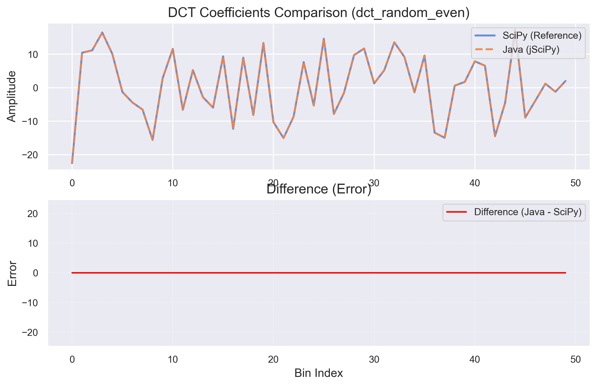
</picture>

<picture>
  <source media="(prefers-color-scheme: dark)" srcset="python/figs/dct/idct_comparison_dark.png">
  <source media="(prefers-color-scheme: light)" srcset="python/figs/dct/idct_comparison_light.png">
  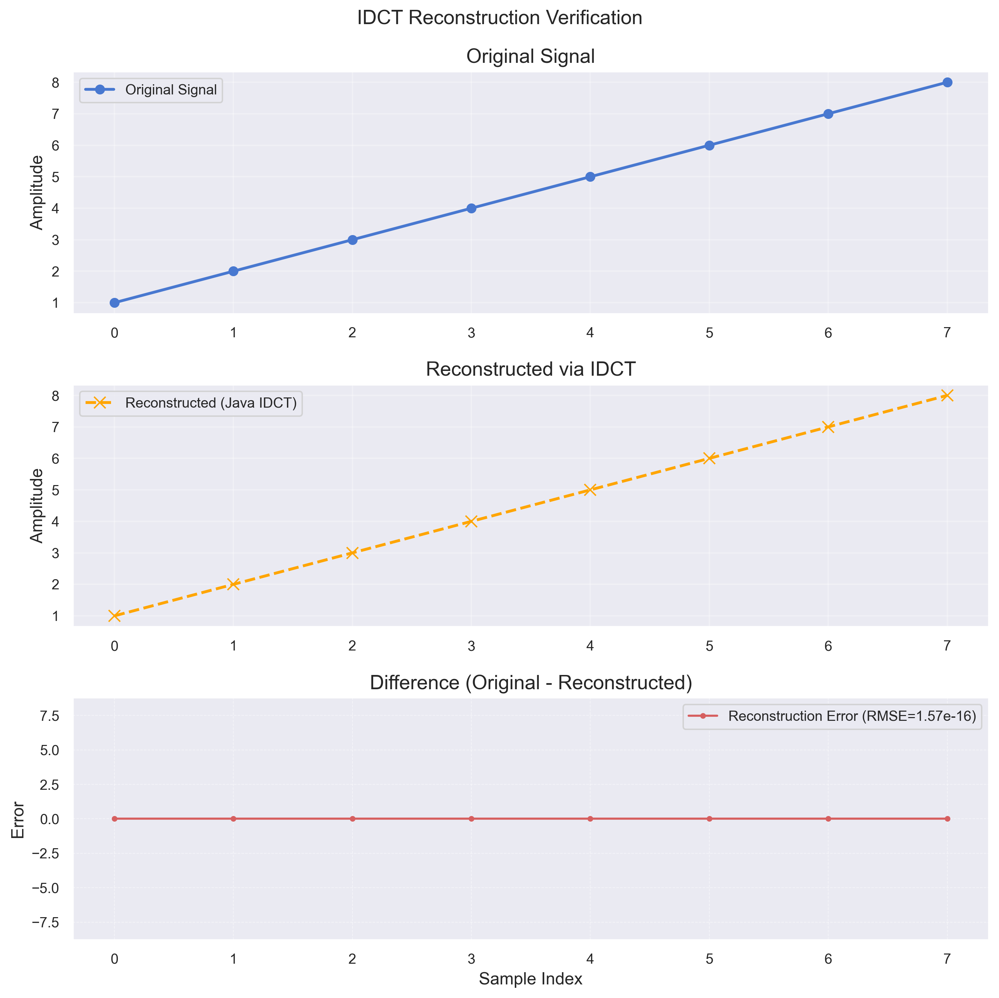
</picture>

</picture>

### FIR Filter Design

<picture>
  <source media="(prefers-color-scheme: dark)" srcset="python/figs/fir/fir_comparison_dark.png">
  <source media="(prefers-color-scheme: light)" srcset="python/figs/fir/fir_comparison_light.png">
  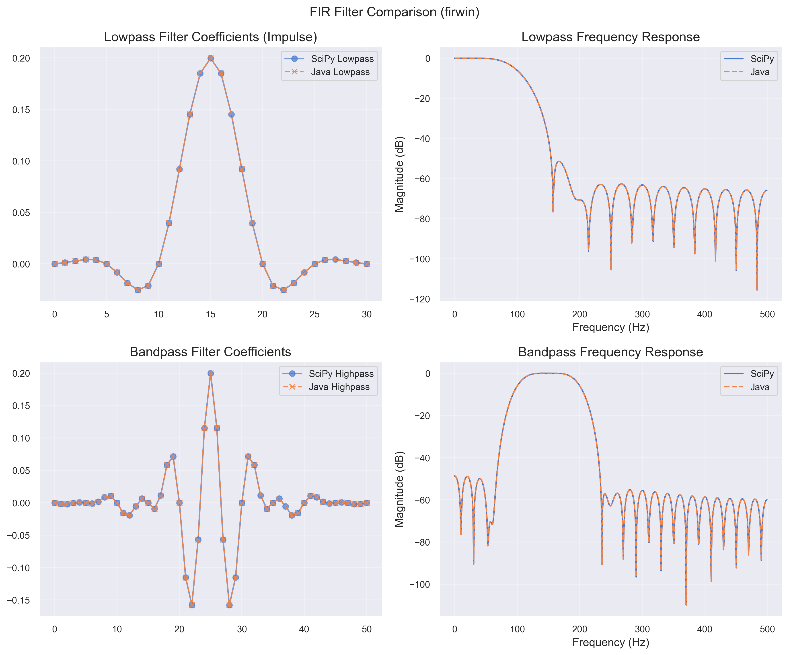
</picture>

### Polynomial Fit Comparison

<picture>
  <source media="(prefers-color-scheme: dark)" srcset="python/figs/poly/polyfit_lstsq_comparison_dark.png">
  <source media="(prefers-color-scheme: light)" srcset="python/figs/poly/polyfit_lstsq_comparison_light.png">
  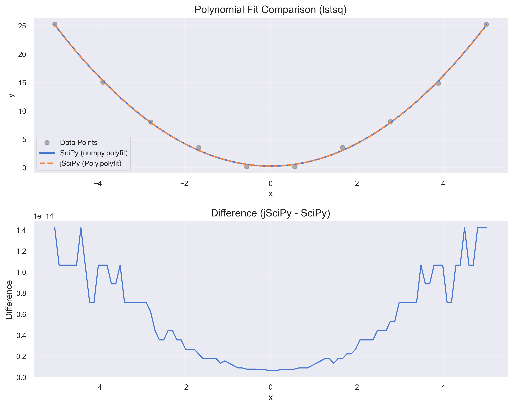
</picture>

### 2D FFT Comparison

<picture>
  <source media="(prefers-color-scheme: dark)" srcset="python/figs/fft2/fft2_comparison_forward_dark.png">
  <source media="(prefers-color-scheme: light)" srcset="python/figs/fft2/fft2_comparison_forward_light.png">
  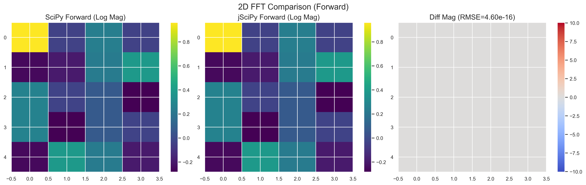
</picture>

### Hilbert Transform Comparison

<picture>
  <source media="(prefers-color-scheme: dark)" srcset="python/figs/hilbert/hilbert_comparison_1_dark.png">
  <source media="(prefers-color-scheme: light)" srcset="python/figs/hilbert/hilbert_comparison_1_light.png">
  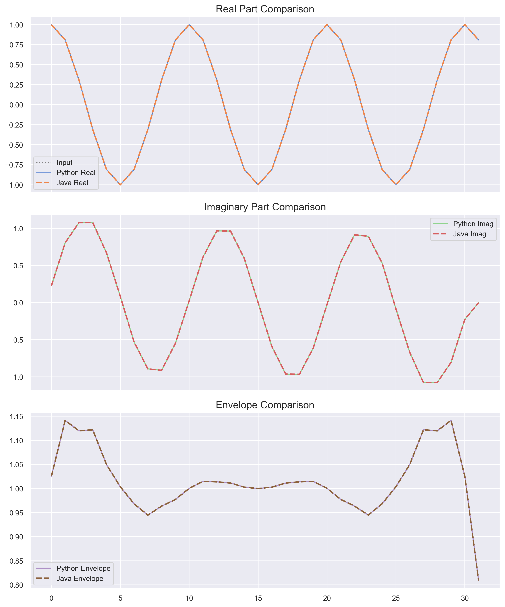
</picture>

### SOS Filtering Comparison

<picture>
  <source media="(prefers-color-scheme: dark)" srcset="python/figs/sos/sos_comparison_dark.png">
  <source media="(prefers-color-scheme: light)" srcset="python/figs/sos/sos_comparison_light.png">
  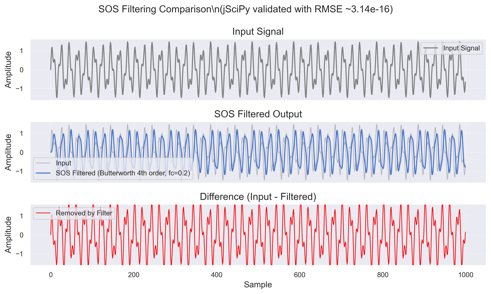
</picture>

### Window Functions Comparison

<p align="center">
  <picture>
    <source media="(prefers-color-scheme: dark)" srcset="python/figs/windows/windows_comparison_dark.png">
    <source media="(prefers-color-scheme: light)" srcset="python/figs/windows/windows_comparison_light.png">
    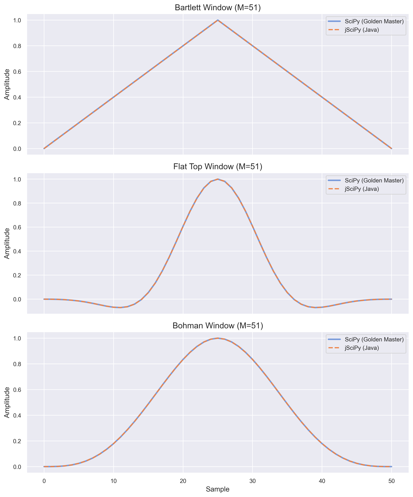
  </picture>
  <br>
</p>


## Usage Examples

### Digital Filters
All standard IIR filters (Butterworth, Chebyshev I/II, Elliptic, Bessel) are supported with consistent APIs.

```java
import com.hissain.jscipy.Signal;

public class FilterExample {
    public static void main(String[] args) {
        double[] signal = {/*... input data ...*/};
        double fs = 100.0;
        double fc = 10.0;
        int order = 4;

        // 1. Butterworth: Zero-phase vs Causal
        double[] zeroPhase = Signal.filtfilt(signal, fs, fc, order);
        double[] causal = Signal.lfilter(signal, fs, fc, order);

        // 2. Chebyshev Type I (Ripple 1dB) & Type II (Stopband 20dB)
        double[] cheby1 = Signal.cheby1_filtfilt(signal, fs, fc, order, 1.0);
        double[] cheby2 = Signal.cheby2_filtfilt(signal, fs, fc, order, 20.0);

        // 3. Elliptic (Ripple 1dB, Stopband 40dB)
        double[] ellip = Signal.ellip_filtfilt(signal, fs, fc, order, 1.0, 40.0);
        
        // 4. Bessel (Linear Phase)
        double[] bessel = Signal.bessel_filtfilt(signal, fs, fc, order);

        // Filter Modes: High-pass, Band-pass, Band-stop
        // Available for all filter types (suffix: _highpass, _bandpass, _bandstop)
        double[] bandPass = Signal.filtfilt_bandpass(signal, fs, 8.0, 4.0, order); // Center=10, Width=4

        // 5. Second-Order Sections (SOS) Filtering
        // If you have SOS coefficients (e.g., from Python/SciPy)
        double[][] sos = { /* ... 6 coefficients per section ... */ };
        double[] sosFiltered = Signal.sosfilt(signal, sos);
    }
}
```

### Correlation & Polynomials
Cross-correlation and polynomial fitting/evaluation.

```java
import com.hissain.jscipy.Signal;
import com.hissain.jscipy.Math;
import com.hissain.jscipy.signal.ConvolutionMode;

public class MathSignalExample {
    public static void main(String[] args) {
        // 1. Cross-Correlation
        double[] x = {1, 2, 3};
        double[] target = {0, 1, 0.5};
        // equivalent to convolve(x, reverse(target), mode)
        double[] corr = Signal.correlate(x, target, ConvolutionMode.FULL);
        
        // 2. Discrete Cosine Transform (DCT Type-II)
        double[] dct = Signal.dct(x);             // Standard
        double[] dctOrtho = Signal.dct(x, true);  // Ortho-normalized
        
        // 3. Polynomials
        // Fit a 2nd degree polynomial to (x, y) points
        double[] xPoints = {0, 1, 2, 3};
        double[] yPoints = {1, 2, 5, 10}; // roughly x^2 + 1
        
        // Coefficients: [1.0, 0.0, 1.0] (for x^2 + 1)
        double[] coeffs = Math.polyfit(xPoints, yPoints, 2);
        
        // Evaluate polynomial at new points
        double[] val = Math.polyval(coeffs, new double[]{4, 5}); 
        
        // Compute derivative: [2.0, 0.0] (2x)
        double[] deriv = Math.polyder(coeffs);
    }
}
```

### Spectral Analysis & Transforms
Includes 1D/2D FFT, DCT/IDCT, STFT/ISTFT, Welch's Method, Periodogram, spectrogram, and Hilbert Transform.

```java
import com.hissain.jscipy.Signal;
import com.hissain.jscipy.signal.JComplex;
import com.hissain.jscipy.signal.fft.Welch;
import com.hissain.jscipy.signal.fft.Spectrogram;
import com.hissain.jscipy.signal.fft.Hilbert;

public class SpectralExample {
    public static void main(String[] args) {
        double[] signal = {/*... input data ...*/};
        double fs = 1000.0;

        // 1. FFT / IFFT
        JComplex[] fft = Signal.fft(signal);
        JComplex[] ifft = Signal.ifft(fft);
        
        // 2. Real-optimized FFT (RFFT)
        JComplex[] rfft = Signal.rfft(signal);
        
        // 3. Welch's Method (PSD)
        Welch.WelchResult psd = Signal.welch(signal, fs, 256);
        // Access: psd.f (frequencies), psd.Pxx (power spectrum)

        // 4. Spectrogram
        Spectrogram.SpectrogramResult spec = Signal.spectrogram(signal, fs);
        // Access: spec.frequencies, spec.times, spec.Sxx

        // 5. Hilbert Transform (Analytic Signal)
        Hilbert h = new Hilbert();
        JComplex[] analytic = h.hilbert(signal);

        // 6. Short-Time Fourier Transform (STFT)
        JComplex[][] stft = Signal.stft(signal); // Uses default nperseg=256, noverlap=128
        
        // 7. Inverse STFT
        double[] reconstructed = Signal.istft(stft);
    }
}
```


### Smoothing & Signal Operations
Common operations for signal conditioning and feature extraction.

```java
import com.hissain.jscipy.Signal;
import com.hissain.jscipy.signal.filter.SavitzkyGolay;
import com.hissain.jscipy.signal.filter.MedFilt;

public class OperationsExample {
    public static void main(String[] args) {
        double[] signal = {/*... data ...*/};

        // 1. Savitzky-Golay Smoothing
        SavitzkyGolay sg = new SavitzkyGolay();
        double[] smoothed = sg.savgol_filter(signal, 5, 2); // Window=5, PolyOrder=2
        double[] deriv = sg.savgol_filter(signal, 5, 2, 1, 1.0); // 1st Derivative

        // 2. Peak Detection
        // Min Height=0.5, Min Distance=10, Min Prominence=0.2
        int[] peaks = Signal.find_peaks(signal, 0.5, 10, 0.2);

        // 3. Median Filter
        double[] med = new MedFilt().medfilt(signal, 3); // Kernel=3

        // 4. Convolution (Mode: SAME, FULL, VALID)
        double[] window = {0.25, 0.5, 0.25};
        double[] conv = Signal.convolve(signal, window, ConvolutionMode.SAME);
        
        // 5. Detrending (Linear)
        double[] detrended = Signal.detrend(signal, DetrendType.LINEAR);
        
        // 6. Resampling (Up/Down sampling)
        // Note: Resampling is part of the Math module
        double[] resampled = com.hissain.jscipy.Math.resample(signal, NEW_LENGTH);
    }
}
```

### Math & Interpolation
General-purpose numerical utilities.

```java
import com.hissain.jscipy.math.RK4Solver;
import com.hissain.jscipy.Math;

public class MathExample {
    public static void main(String[] args) {
        // 1. Interpolation (Linear & Cubic)
        double[] x = {0, 1, 2}, y = {0, 1, 4};
        double[] query = {0.5, 1.5};
        
        double[] lin = Math.interp1d_linear(x, y, query);
        double[] quad = Math.interp1d_quadratic(x, y, query);
        double[] cub = Math.interp1d_cubic(x, y, query);
        double[] bspline = Math.interp1d_bspline(x, y, query, 3); // B-spline with degree k=3

        // 2. RK4 ODE Solver (dy/dt = -y)
        RK4Solver solver = new RK4Solver();
        RK4Solver.Solution sol = solver.solve((t, y) -> -y, y0, t0, tf, step);
    }
}
```

## Contributing

Contributions are welcome! Please read our [Contribution Guidelines](CONTRIBUTING.md) for details on our workflow and coding standards. Feel free to submit issues or pull requests.

### Areas for Contribution (Help Wanted)

We are actively looking for contributors to help with:
1.  **Performance Benchmarking**: Creating benchmarks for large datasets to compare Java's performance vs NumPy/SciPy.
2.  **Feature Expansion**: Implementing missing window functions or additional filter types.
3.  **Edge Case Robustness**: Improving handling of `NaN`, `Infinity`, and edge cases in signal processing algorithms.
4.  **Documentation**: Adding more usage examples and javadocs.

Want to join in community discord? click [here](https://discord.com/channels/1464079471790395404/1464079472407089313)

## License

This project is licensed under the [MIT License](LICENSE).
